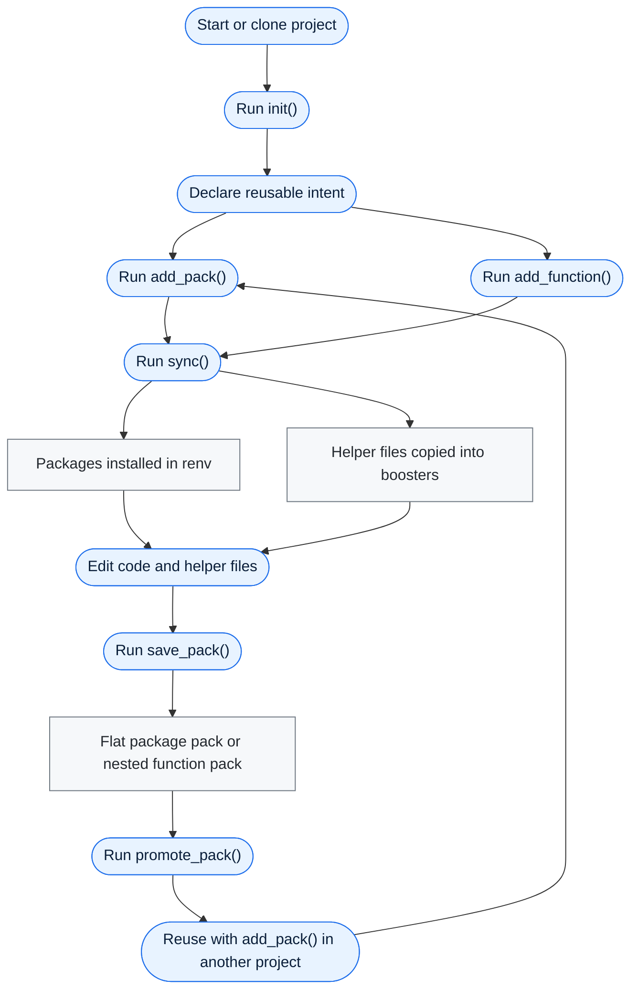

# boosterpak


`boosterpak` is an R package for declaring project package intent in a human-edited `boosters.toml` file. It resolves named "booster" packs from project, user, and built-in scopes, installs missing packages with `pak`, and uses `renv` for project-local libraries and lockfiles.

## 1. Install pak

``` r
install.packages("pak")
```

## 2. Install boosterpak

``` r
pak::pkg_install("seanthimons/boosterpak")
```

## 3. Initialize the project

``` r
boosterpak::init(renv = "yes", rprofile = "yes")
```

`init()` writes `boosters.toml`, creates `boosters/packs/`, optionally writes `air.toml`, manages the `.Rprofile` helper-source line, and can initialize project-local `renv`. The generated manifest includes `boosterpak` itself as a project extra so collaborators can restore and sync the project from its declared intent.

## 4. Sync the project

``` r
boosterpak::sync()
```

## Typical Workflow



The usual loop is to initialize once, add packs and helper functions as project intent, run `sync()`, then capture a useful baseline with `save_pack()`. Package-only packs stay flat at `boosters/packs/<name>.toml`; packs that carry copied helper files use `boosters/packs/<name>/<name>.toml` plus `boosters/packs/<name>/functions/`.

## Add a Pack

``` r
boosterpak::add_pack("example")
```

The built-in pack catalog contains:

-   `core`: `fs`, `here`, `janitor`, `rio`, `tidyverse`, and `digest`.
-   `example`: extends `core` and installs `cli`.
-   `scaffold-analysis`: installs `fs` and `here` and carries a helper for a compact analysis folder scaffold.
-   `github-example`: installs `ComptoxR` from `seanthimons/ComptoxR`.

Packs can mix ordinary CRAN package names with source-specific install specs. Declare every package in `packages`, then add a `[sources]` entry only for packages that should come from somewhere else:

``` toml
name = "plotting"
description = "Plotting packages from CRAN and GitHub."
packages = ["ggplot2", "patchwork", "ggtext"]

[sources]
"ggtext" = "wilkelab/ggtext"
```

In this pack, `ggplot2` and `patchwork` install by package name, while `ggtext` uses the GitHub source spec.

Pack mutation is additive. Removing a pack updates `boosters.toml` and can run sync, but it does not uninstall packages.

## Capture and Reuse Packs

``` r
boosterpak::save_pack("project_baseline")
boosterpak::promote_pack("project_baseline")
```

`save_pack()` writes a TOML snapshot of the currently resolved project packages and, by default, the helper functions listed in `[functions].installed`. Use `functions = "all"` to capture every `boosters/fn_*.R` file, `functions = "none"` for a flat package-only pack, `from = "core"` to fork one existing pack, or `scope = "user"` to write directly to the machine-wide user pack directory. `promote_pack()` and `demote_pack()` copy flat package-only packs as single files and nested function-bearing packs as whole directories.

## Restore from a Lockfile

``` r
boosterpak::sync(mode = "restore")
```

`sync(mode = "apply")` treats `boosters.toml` as intent and `renv.lock` as downstream output. `sync(mode = "restore")` is the explicit path for exact lockfile restoration.

## Inspect Status

``` r
boosterpak::status()
boosterpak::list_packs()
```

`status()` reports config validity, declared and resolved packs, package counts, missing direct packages, function drift or missing materialized files, pack catalog counts, `renv` state, lockfile presence, and the `.Rprofile` hook.

Current development includes function materialization, pack capture/promotion, and broader project status reporting; pruning remains out of scope.
