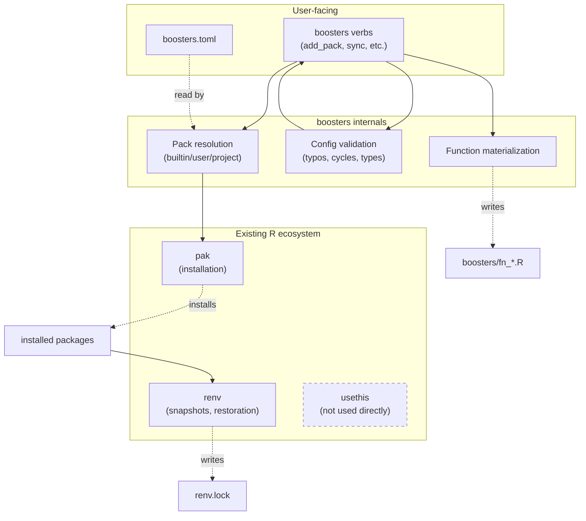

# `boosters` — Product Requirements Document

**Status:** Draft v0.1
**Author:** Sean Thimons
**Last updated:** 2026-05-18

---

## 1. Motivation

R practitioners accumulate durable, hard-won knowledge that doesn't fit cleanly into any one R artifact:

- *"Which packages do I always reach for when doing exploratory data analysis?"*
- *"What was the exact `ggsave()`/camcorder configuration I used for that last high-res figure?"*
- *"What's my preferred `skim_with()` recipe?"*
- *"How do I get a new coworker up and running with all of the above in under five minutes?"*

Today this knowledge typically lives in a personal gist (the author's [`load_packages.R`](https://gist.github.com/seanthimons/83106864852fa31b2624b87a30c4a4e3) is the proximate example), a `.Rprofile`, scattered Slack messages, or — most commonly — nowhere durable, surviving only in the practitioner's working memory.

The cost is real:

1. **Self-friction.** Starting a new project means re-deriving the same scaffolding.
2. **Onboarding friction.** Getting a coworker to "work like me" requires shipping them a file, explaining which lines to uncomment, and hoping they don't drift.
3. **Drift across projects.** Two of *your own* projects begun three months apart will diverge in non-obvious ways, making it hard to move code between them.
4. **No clean upgrade path.** When you learn a better idiom (`pak` over `install.packages()`, `nanoparquet` over `arrow` for some use cases), updating every project is manual.

`boosters` is an R package that solves these problems by giving practitioners a UV/Cargo-style declarative project manifest, a small but composable system of curated package bundles ("boosters"), and an opt-in mechanism for materializing personal helper functions into projects.

The design borrows from package managers that have demonstrably reduced friction in adjacent ecosystems: **Cargo** (Rust), **UV** (Python), and to a lesser extent **renv** (R) and **shadcn/ui** (TypeScript/React). It does not attempt to replace `renv`, `pak`, or `usethis` — it composes with them.

---

## 2. Target users

**Primary:** R practitioners who already have a personal "starter file" (gist, `.Rprofile`, snippet collection) and want to formalize it without writing a full R package every time.

**Secondary:** Coworkers, collaborators, and team members who need to be onboarded onto a primary user's working conventions with minimal effort.

**Explicitly not targeted in v0.1:**

- R package authors building production packages (use `usethis` / `devtools`).
- Shiny app developers using `golem` or `rhino` (though `boosters` should not collide with these — see §6.2).
- Users seeking a full reproducibility lockfile system (use `renv` directly; `boosters` interoperates with but does not replace it).

---

## 3. Goals & non-goals

### 3.1 Goals

| # | Goal |
|---|------|
| G1 | One-command onboarding: `pak::pkg_install("seanthimons/boosters"); boosters::sync()` reproduces the author's environment in a cloned project. |
| G2 | Human-edited project config in a single, forgiving file format (TOML). |
| G3 | Composable package bundles via "packs," with three scopes: built-in, user, project. |
| G4 | Personal helper functions (`%ni%`, `my_skim`, etc.) ship as defaults in the package and can be opt-in materialized into projects as editable files. |
| G5 | Verb-driven mutation (`add_pack`, `remove_pack`, `add_function`, `remove_function`, `sync`) — never require hand-editing TOML, though that path remains valid. |
| G6 | Aggressive validation: typos in pack names get did-you-mean suggestions; cycles in pack composition are detected; the tool fails loudly and helpfully. |
| G7 | Zero collision with `golem`, `rhino`, `usethis`, `devtools`, or `renv` workflows. |

### 3.2 Non-goals

| # | Non-goal | Rationale |
|---|---|---|
| NG1 | Replacing `renv` as the lockfile system. | `renv` already does this well. `boosters` produces `renv.lock` via `renv::snapshot()` and considers it the source of truth for installed versions. |
| NG2 | Cross-language environment management. | UV does this for Python; `boosters` is R-only. |
| NG3 | A package registry or hosting service for community packs. | v0.1 supports sharing packs via TOML files exchanged out-of-band (Slack, GitHub gists, etc.). Centralized discovery is deferred. |
| NG4 | User-authored functions sourced from arbitrary external repos. | Materialized functions ship with `boosters` itself; community functions are deferred (see §9). |
| NG5 | A GUI / RStudio addin. | CLI-only in v0.1. Addins may be added later. |
| NG6 | Configuration of arbitrary tool settings beyond what `boosters` itself uses. | The `[settings]` table holds `boosters`-specific options only. Not a general-purpose project config file. |

---

## 4. Anchor scenarios

These are the user stories the design must serve. Every design decision in this PRD traces back to at least one of these.

### Scenario A: Starting a new project

> Sean creates a new project in RStudio. He runs `boosters::init()`. A `boosters.toml` appears in the project root with sensible defaults. He runs `boosters::sync()`. The tidyverse plus a handful of his standard packages are installed. He opens a Quarto doc and starts working.

### Scenario B: Adding a capability to an existing project

> Sean is mid-project and realizes he needs spatial analysis. He runs `boosters::add_pack("spatial")`. The pack's packages are installed immediately. He restarts R and `sf` is available.

### Scenario C: Onboarding a coworker

> Sean's coworker clones the project's git repo. They run `boosters::sync()`. Every package the project declares is installed (or restored from `renv.lock` if present). The project's custom helper functions (`my_skim`, `theme_custom`, `%ni%`) appear in `boosters/` and are sourced at session start. The coworker opens R and is working in Sean's environment without further setup.

### Scenario D: Capturing a working environment as a reusable pack

> Sean has been refining a project's package list and likes the current state. He runs `boosters::save_pack("project_baseline")`. A new TOML file is written to `boosters/packs/project_baseline.toml` capturing the current package set. He can reference this pack from other projects.

### Scenario E: Promoting a useful project pack to user scope

> Sean's `project_baseline` pack proves broadly useful. He runs `boosters::promote_pack("project_baseline")`. The pack is copied to `~/.config/boosters/packs/` and is now available across all his projects on this machine.

### Scenario F: Customizing a helper function

> Sean wants `my_skim` to include a coefficient-of-variation column. He runs `boosters::add_function("my_skim")`. A file `boosters/fn_my_skim.R` appears with the package's default implementation. He edits it. His project now uses his customized version; the package default is unchanged.

---

## 5. Lifecycle overview

This is the mental model the entire system is built around. Everything below is implementation detail in service of this diagram:


**Key invariants:**

- **TOML is always the source of truth.** Every mutation flows through it. The filesystem (`boosters/*.R`) and the installed environment are projections.
- **`sync()` is the reconciliation function.** It exists to make the filesystem and environment match what TOML declares.
- **Mutate verbs are eager by default.** `add_pack("spatial")` installs `sf` immediately; it doesn't just edit TOML and defer.
- **`renv.lock` is downstream.** `boosters` produces `renv.lock` as a side effect of sync, but never reads from it for intent — TOML is intent, `renv.lock` is reality.

---

## 6. File layout and conventions

### 6.1 Project root after `init()` and basic usage

```
my-project/
├── boosters.toml              # human-edited config (intent)
├── boosters/                  # tool-managed (projection)
│   ├── fn_ni.R                # one file per materialized function
│   ├── fn_my_skim.R
│   └── packs/                 # project-scoped pack definitions
│       └── project_baseline.toml
├── renv.lock                  # machine-managed (reality)
├── renv/                      # renv's internals
├── air.toml                   # written by init() if requested
├── .Rprofile                  # contains the boosters source line
└── (rest of project)
```

### 6.2 Why `boosters/` and not `R/`?

`R/` is a reserved directory for R package source code. Using it for `boosters`'s materialized files would:

- Collide with `golem`, `rhino`, and any `usethis::create_package()` project.
- Trip `R CMD check` and `devtools::load_all()`.
- Cause double-loading if the project later becomes a package.

`boosters/` is namespaced, self-documenting, and zero-collision. It mirrors how `renv/` is named.

### 6.3 File naming inside `boosters/`

Materialized function files use the prefix `fn_` (e.g., `fn_ni.R`, `fn_my_skim.R`). This serves two purposes:

1. Makes it visually obvious which files are managed by `boosters` vs. user-added.
2. Reserves the un-prefixed namespace for future tool use (e.g., `init_*.R`, `recipe_*.R`).

> **[AMBIGUITY 6.3.A]** Should the `fn_` prefix appear in the function name itself, or only in the filename? Recommend filename-only — `boosters::add_function("ni")` materializes `boosters/fn_ni.R` which defines `` `%ni%` ``. The user-facing identifier ("ni") and the file naming convention are separable. **Coding agent: confirm with author before implementing.**

### 6.4 The `.Rprofile` line

`init()` appends one line to `.Rprofile`:

```r
if (dir.exists("boosters")) invisible(lapply(list.files("boosters", "^fn_.*\\.R$", full.names = TRUE), source))
```

This is the only piece of "automatic" behavior in the system. It sources every `fn_*.R` file in `boosters/` at session start.

**Design decisions:**

- The pattern `^fn_.*\\.R$` ensures only function files are sourced. Pack TOMLs in `boosters/packs/` are unaffected (different extension), and any future `boosters/`-managed files with other prefixes won't accidentally execute.
- `init()` MUST show the user the exact line being added and ask for confirmation before modifying `.Rprofile`.
- If `.Rprofile` already exists and the line is already present, do nothing.
- If the user removes the line manually, `boosters` does not re-add it on subsequent `init()` calls.

> **[AMBIGUITY 6.4.A]** What's the behavior if `.Rprofile` exists but doesn't have the boosters line, and the user re-runs `init()`? Options: (a) error; (b) prompt to add; (c) silently add. Recommend (b). **Coding agent: confirm before implementing.**

---

## 7. Configuration: `boosters.toml`

The project-level config file. Human-edited (though normally mutated by verbs). Single file for the project; pack definitions live elsewhere (see §8).

### 7.1 Example

```toml
# boosters.toml — project configuration
# Edit this file directly or use boosters::add_pack() / remove_pack() etc.

[project]
name = "my-water-quality-analysis"
boosters_version = "0.1.0"   # the version of boosters that wrote this file

[packs]
declared = ["core", "eda", "spatial"]

[extras]
# One-off packages not in any pack
declared = [
  "seanthimons/ComptoxR",
  "rstudio/pointblank",
]

[exclude]
# Packages a pack would normally include, but you don't want
declared = ["arrow"]

[functions]
installed = ["ni", "my_skim"]

[settings]
air_toml = true                          # write air.toml on init
parallel_daemons = "auto"                # or an integer
auto_snapshot = true                     # call renv::snapshot() at end of sync()

[settings.camcorder]
enabled = false
dpi = 320
width = 10
height = 7
units = "in"
```

### 7.2 Schema notes

- **`[project].boosters_version`** is written by `init()` and updated by `sync()`. It's informational, not a constraint — `boosters` does not refuse to operate on TOMLs from older versions, but `sync()` may warn if the file was written by a newer version than the installed `boosters`.
- **`[packs].declared`** is the list of pack names to install. Resolution order: project → user → built-in (see §8.3).
- **`[extras].declared`** holds packages not bundled in any pack. Strings can be plain CRAN names (`"pointblank"`), `user/repo` GitHub references, or anything `pak` understands.
- **`[exclude].declared`** is a deny-list applied after pack resolution. If `spatial` includes `arrow` but you don't want it, list `arrow` here.
- **`[functions].installed`** tracks which function files have been materialized via `add_function()`. `sync()` ensures every name here corresponds to a file in `boosters/`.
- **`[settings]`** holds `boosters`-specific options. The nested `[settings.camcorder]` is a worked example; settings are NOT a general-purpose config bag for unrelated tools.

> **[AMBIGUITY 7.2.A]** Should `[settings.camcorder]` actually drive runtime behavior in v0.1, or is it purely declarative (the user copies values into their own code)? Recommend: declarative only in v0.1. `boosters` ships a `boosters::camcorder_config()` helper that reads the TOML and returns a list the user passes to `camcorder::gg_record()`. Don't auto-call `gg_record()` on session start — too magical. **Coding agent: confirm scope of settings consumption.**

> **[AMBIGUITY 7.2.B]** Format of the `boosters_version` field — semver string? Or include the package version object? Recommend plain string matching `utils::packageVersion("boosters")`. **Coding agent: confirm.**

### 7.3 Validation requirements

When `sync()` runs, it validates `boosters.toml` BEFORE any `pak` calls:

1. **TOML parses.** Surface the parser's error verbatim with file and line.
2. **All declared pack names resolve.** Unknown names get a did-you-mean suggestion via `agrep` or `stringdist::amatch` against the union of available packs.
3. **All function names in `[functions].installed` exist in the package's catalog.** Same did-you-mean treatment.
4. **No cycles in pack `extends` chains** (see §8.4).
5. **Type checks on settings.** `parallel_daemons` is `"auto"` or a positive integer; `dpi` is a positive integer; etc.
6. **Unknown keys produce warnings, not errors.** Forward-compat for newer `boosters` versions writing fields older versions don't understand.

The validator's error messages should look like this:

```
✖ boosters.toml is invalid:

  In [packs].declared (line 9):
    "spatail" is not a known pack.
    Did you mean: "spatial"?

  Available packs:
    Built-in: core, eda, spatial, web, plot, modeling, shiny, report
    User:     my_eda
    Project:  project_baseline

  Run boosters::list_packs() for descriptions.
```

This is the difference between a tool that's pleasant and one that isn't. Budget real time for error-message design.

---

## 8. Packs

### 8.1 Three scopes

| Scope | Location | Authored by | Travels with |
|---|---|---|---|
| Built-in | `inst/packs/*.toml` inside the `boosters` package | Package maintainer (Sean) | The `boosters` package version |
| User | `tools::R_user_dir("boosters", "config")/packs/*.toml` | The user | The user's machine |
| Project | `boosters/packs/*.toml` in the project root | The user (in a project) | The project (via git) |

### 8.2 Pack TOML schema

```toml
# boosters/packs/my_eda.toml
name = "my_eda"
description = "My standard EDA stack with cohort-specific extras"

packages = [
  "tidyverse",
  "skimr",
  "janitor",
  "fuzzyjoin",
]

# Packs this one extends. Resolved transitively.
extends = ["core"]

# Per-package source overrides for non-CRAN packages.
[sources]
"ComptoxR" = "seanthimons/ComptoxR"
"pointblank" = "rstudio/pointblank"
```

**Schema rules:**

- `name` is required and must match the filename (minus `.toml`).
- `description` is required (used in `list_packs()` output).
- `packages` is required, even if empty (a pack that only extends others is unusual but legal).
- `extends` is optional; if absent, the pack stands alone.
- `[sources]` is optional and maps package names to `pak`-resolvable source strings.

### 8.3 Resolution order

When the user references pack `"eda"`:

1. Look in `./boosters/packs/eda.toml` (project scope).
2. If not found, look in `<user_config>/packs/eda.toml` (user scope).
3. If not found, look in `system.file("packs/eda.toml", package = "boosters")` (built-in).
4. If still not found: validation error with did-you-mean.

**First match wins.** This means user and project packs can shadow built-in packs of the same name. This is intentional — it lets users customize without forking. `list_packs()` always shows the source so there's no mystery.

### 8.4 Pack composition via `extends`

A pack's effective package list is the union of:

- Its own `packages` field
- The effective package lists of all packs in its `extends` field (recursive)
- Minus any packages in the project's `[exclude].declared`

Resolution algorithm:

```
resolve_pack(name, visited = set()):
  if name in visited: ERROR "cycle detected: {visited} -> {name}"
  pack = load_pack(name)
  result = pack.packages
  for parent in pack.extends:
    result = union(result, resolve_pack(parent, visited + {name}))
  return result
```

The cycle check is non-optional. Implement it in v0.1 even though users are unlikely to hit it — the failure mode without it (stack overflow with an opaque message) is significantly worse than the cost of implementing it.

### 8.5 The `save_pack` workflow

`boosters::save_pack(name, scope = "project", from = NULL)` captures the current project's resolved package set as a new pack TOML.

- `scope = "project"` (default): writes to `boosters/packs/<name>.toml`.
- `scope = "user"`: writes to `<user_config>/packs/<name>.toml`.
- `from = NULL` (default): captures all packages currently resolved from the project's `boosters.toml`.
- `from = "spatial"`: captures only what the named pack contributes (useful for forking a built-in pack to customize).

The saved pack flattens to actual package names; it does not retain `extends` references to other packs. This is intentional — the captured pack is a snapshot, not a live composition. If the parent pack changes upstream, the saved pack does not drift.

`boosters::promote_pack(name)` copies a project pack to user scope. `boosters::demote_pack(name)` is the inverse. Both refuse to overwrite without `overwrite = TRUE`.

> **[AMBIGUITY 8.5.A]** When `save_pack` runs in a project that has `[extras]` and `[exclude]` declared, should those be folded into the saved pack? Recommend: yes, fold them into `packages` (extras included, excludes removed). The saved pack should be self-contained. **Coding agent: confirm before implementing.**

### 8.6 Built-in pack catalog (v0.1)

The initial built-in packs, drawn from the author's gist. Each lives in `inst/packs/<name>.toml` in the package source.

| Pack | Purpose | Approximate contents |
|---|---|---|
| `core` | Always-useful foundation | `fs`, `here`, `janitor`, `rio`, `tidyverse`, `digest` |
| `parallel` | Parallel/async execution | `futureverse`, `mirai`, `parallel` |
| `db` | Local databases & columnar storage | `nanoparquet`, `duckdb`, `duckplyr`, `dbplyr` |
| `eda` | Exploratory data analysis | `skimr`, `fuzzyjoin`, `powerjoin` |
| `web` | HTTP & scraping | `rvest`, `polite`, `httr2` |
| `plot` | Plotting extensions | `paletteer`, `ragg`, `camcorder`, `patchwork`, `ggtext`, `ggrepel`, `ggdist` |
| `spatial` | Geospatial workflows | `sf`, `geoarrow`, `duckdbfs`, `tidycensus`, `mapgl`, `dataRetrieval`, `StreamCatTools` |
| `modeling` | Statistical modeling | `tidymodels`, `MuMIn`, `infer`, `tidytext` |
| `shiny` | Web apps | `shiny`, `bslib`, `DT`, `plotly` |
| `report` | Reporting | `quarto`, `gt`, `gtsummary` |

> **[AMBIGUITY 8.6.A]** The exact package list per pack is a curatorial decision. The list above mirrors the author's current gist; coding agent should treat these as initial values, not requirements. The author should review and adjust before v0.1 ships. **Coding agent: present this list to author for final approval before implementation.**

---

## 9. Functions

### 9.1 The default-vs-materialized model

This is the most novel piece of the design and bears explanation.

**Every catalog function exists in two forms:**

1. **The default**, exported by the `boosters` package itself. Always available via `boosters::my_skim()` etc. with no user action.
2. **The materialized copy**, written to `boosters/fn_<name>.R` in the project when the user calls `add_function()`. The materialized copy shadows the default for that project (because the `.Rprofile` line sources it after the package loads).

This is the [shadcn/ui](https://ui.shadcn.com/) pattern adapted to R. It serves two needs simultaneously:

- **Defaults work out of the box.** A coworker who never touches `add_function()` still gets `boosters::my_skim()`.
- **Customization is non-destructive.** Editing `boosters/fn_my_skim.R` does not affect any other project, and the package's default version stays as a reference.

### 9.2 Catalog (v0.1)

Initial functions, drawn from the author's gist:

| Function | Description |
|---|---|
| `ni` | `` `%ni%` `` — negation of `%in%` |
| `my_skim` | `skim_with()` preset for numeric EDA with geometric mean and inline histogram |
| `theme_custom` | Minimal ggplot2 theme with white panels and angled x-axis labels |
| `geo_mean` | Geometric mean of positive values |

> **[AMBIGUITY 9.2.A]** Are there other helper functions in the author's day-to-day workflow that should ship in the initial catalog? The gist is heavily commented; some functions may be intentional inclusions and others abandoned experiments. **Coding agent: ask the author to confirm the v0.1 catalog before implementation.**

### 9.3 Verbs

- `boosters::list_functions()` — show all available functions with descriptions and current installation status.
- `boosters::add_function(name)` — copy the package's version of the function into `boosters/fn_<name>.R` and add `name` to `[functions].installed`.
- `boosters::remove_function(name)` — delete `boosters/fn_<name>.R` and remove from TOML.
- `boosters::check_functions()` — diff installed local copies against the current package versions; report drift.

### 9.4 The `check_functions()` drift detector

When `boosters` ships a v0.2 with an improved `my_skim`, projects that already materialized `my_skim` keep their old version (correctly — overwriting user edits silently would be hostile). But the user should be able to see this:

```
boosters::check_functions()
#> ℹ boosters/fn_my_skim.R differs from boosters::my_skim (package v0.2.0)
#>   Run boosters::diff_function("my_skim") to see changes.
#>   Run boosters::add_function("my_skim", overwrite = TRUE) to update.
#>
#> ✔ boosters/fn_ni.R matches package version.
```

This is the same pattern shadcn implements (`npx shadcn diff`).

> **[AMBIGUITY 9.4.A]** How is the "package version" of a function determined for diffing? Options: (a) literal string comparison against the file in `inst/functions/<name>.R`; (b) tracking a hash in `[functions]` (e.g., `installed = [{ name = "my_skim", hash = "..." }]`); (c) version stamp in the materialized file's comment header. Recommend (a) for simplicity in v0.1, (b) if it turns out users frequently want "I'm on a known-good snapshot, don't bother me about drift." **Coding agent: confirm.**

### 9.5 Deferred: user-authored function sources

The compelling but underspecified feature is `add_function("my_thing", source = "github:user/repo")` — pulling a function from an external source. This is deferred because:

1. The trust/safety model is non-trivial (arbitrary R code from the internet).
2. The interaction with `check_functions()` is unclear (what does "drift" mean for an external source?).
3. There's no concrete usage pattern to design against in v0.1.

When this returns in v0.3 or later, it'll need its own mini-PRD.

---

## 10. The verb surface

Complete inventory of public functions.

### 10.1 Project lifecycle

| Verb | Purpose |
|---|---|
| `boosters::init()` | Initialize a new project. Writes `boosters.toml`, optionally `air.toml`, and the `.Rprofile` line. Errors if `boosters.toml` already exists. |
| `boosters::sync()` | Reconcile the installed environment to match `boosters.toml`. Installs/removes packages, materializes function files, optionally calls `renv::snapshot()`. |
| `boosters::status()` | Show what's declared in TOML vs. what's actually present (untracked function files, missing packages, drifted functions). |

### 10.2 Pack management

| Verb | Purpose |
|---|---|
| `boosters::add_pack(name)` | Add a pack to `[packs].declared`. Eagerly syncs by default. |
| `boosters::remove_pack(name)` | Remove a pack from `[packs].declared`. Eagerly syncs by default. |
| `boosters::list_packs(scope = NULL)` | List available packs (built-in + user + project) with descriptions and sources. |
| `boosters::save_pack(name, scope = "project", from = NULL)` | Capture the current resolved package set as a new pack TOML. |
| `boosters::promote_pack(name)` | Copy a project pack to user scope. |
| `boosters::demote_pack(name)` | Copy a user pack to project scope. |

### 10.3 Function management

| Verb | Purpose |
|---|---|
| `boosters::add_function(name)` | Materialize a function into `boosters/fn_<name>.R`. Updates TOML. |
| `boosters::remove_function(name)` | Delete the materialized file and remove from TOML. |
| `boosters::list_functions()` | Show available functions with descriptions and installation status. |
| `boosters::check_functions()` | Report drift between materialized files and package versions. |
| `boosters::diff_function(name)` | Show diff between materialized and package versions. |

### 10.4 Common arguments

- **`sync = TRUE/FALSE`** on mutate verbs. Default `TRUE` (eager). `sync = FALSE` edits TOML only, defers installation.
- **`overwrite = FALSE`** on operations that could clobber. Always default `FALSE`; refuse with a clear error message that suggests the explicit flag.

### 10.5 Output style

All verbs use `cli` for output. Conventions:

- ✔ for success (`cli_alert_success`)
- ✖ for errors (`cli_abort`)
- ℹ for informational (`cli_alert_info`)
- ! for warnings (`cli_alert_warning`)

Verbs return invisibly (typically the updated config or affected file paths) so they compose in scripts but don't clutter interactive sessions.

> **[AMBIGUITY 10.5.A]** Should verbs print a summary by default in interactive sessions and stay silent in scripts (`rlang::is_interactive()`)? Recommend yes, with a `verbose` argument to override. **Coding agent: confirm.**

---

## 11. Relationship to `renv`, `pak`, and the broader ecosystem

`boosters` is a layer *above* existing tools, not a replacement. This section is explicit about who does what.



**Who does what:**

| Task | Tool |
|---|---|
| Declaring intent (which packages, which functions) | `boosters` (`boosters.toml`) |
| Resolving pack names to package lists | `boosters` |
| Installing packages | `pak` (called by `boosters`) |
| Locking installed versions | `renv` (called by `boosters` when `auto_snapshot = true`) |
| Restoring environment from lockfile (e.g. on `sync()` in a clone) | `renv::restore()` if `renv.lock` exists, else `pak::pkg_install()` from declared packs |
| Project initialization | `boosters::init()`, NOT `usethis::create_project()` |

### 11.1 Workflow comparison

**Pure `renv` (today):**

1. `renv::init()` initializes lockfile-driven environment.
2. User installs packages manually (`install.packages()`, `remotes::install_github()`).
3. `renv::snapshot()` captures state to `renv.lock`.
4. Collaborator runs `renv::restore()` to reproduce.

**`renv` + `boosters`:**

1. `boosters::init()` writes `boosters.toml` (intent) and optionally calls `renv::init()`.
2. User runs `boosters::add_pack("eda")` — installs via `pak`, snapshots via `renv` if enabled.
3. Collaborator runs `boosters::sync()` — installs from `renv.lock` if present, else from declared packs.

The key difference: `boosters.toml` is the *intent layer* that `renv.lock` alone doesn't provide. A `renv.lock` says "these exact 47 packages at these exact versions"; a `boosters.toml` says "I want the spatial pack and the eda pack" — which generates the 47-package list.

### 11.2 Interop with `rv`

> **[AMBIGUITY 11.2.A]** The author mentioned `rv` (Posit's nascent Rust-based R package manager) in conversation. As of writing, `rv` is early-stage and its CLI is not stable. `boosters` should NOT depend on `rv` in v0.1, but the design should not preclude a future "use `rv` instead of `pak`" option. Recommend treating the installer as a hidden internal abstraction (`boosters:::install_via()` with a `pak` implementation in v0.1) so a future `rv` backend is additive. **Coding agent: confirm direction; defer concrete `rv` work.**

---

## 12. Milestones

`boosters` does not need to ship as one piece. Recommended phasing:

### Phase 1 — Walking skeleton (v0.1)

**Goal:** End-to-end happy path for Scenarios A, B, and C.

- `init()`, `sync()`, `add_pack()`, `remove_pack()`, `list_packs()`
- TOML schema for project config and pack files
- Built-in pack catalog (10 packs from §8.6)
- Pack resolution (project → user → built-in) with cycle detection
- Validation with did-you-mean for typos
- `pak`-backed installation
- `.Rprofile` line management
- `cli`-styled output

**Out of scope for v0.1:** function management, `save_pack`, drift detection.

### Phase 2 — Function materialization (v0.2)

**Goal:** Scenario F (customizing helper functions).

- Built-in function catalog (4 functions from §9.2)
- `add_function()`, `remove_function()`, `list_functions()`
- Materialization to `boosters/fn_*.R`
- `[functions].installed` in TOML
- `check_functions()` drift detection
- `diff_function()` for inspection

### Phase 3 — Pack capture and promotion (v0.3)

**Goal:** Scenarios D and E.

- `save_pack()` with `scope` and `from` arguments
- `promote_pack()` / `demote_pack()`
- User-scope pack directory management (`tools::R_user_dir`)
- `list_packs()` extended to show all three scopes

### Phase 4 — Polish and ecosystem (v0.4+)

- `status()` command (declared vs. reality reporting)
- Better error messages from real usage
- Optional RStudio addin
- `rv` backend exploration (if `rv` stabilizes)
- User-authored function sources from external repos (the deferred feature in §9.5)
- Sharing/discovery features (deferred from non-goals)

---

## 13. Open questions & decisions deferred

Consolidated index of every `[AMBIGUITY]` marker above, plus broader open questions. The coding agent should resolve these *before* implementing the relevant section.

### 13.1 Specific ambiguities

| ID | Question | Recommendation |
|---|---|---|
| 6.3.A | `fn_` prefix in function name or filename only? | Filename only. |
| 6.4.A | Behavior of `init()` when `.Rprofile` exists without the boosters line? | Prompt to add. |
| 7.2.A | Should `[settings.camcorder]` drive runtime behavior or just be declarative? | Declarative only; expose via `boosters::camcorder_config()`. |
| 7.2.B | Format of `boosters_version` in TOML? | Plain string matching `utils::packageVersion("boosters")`. |
| 8.5.A | Should `save_pack` fold `[extras]` and `[exclude]` into the saved pack? | Yes. Saved packs are self-contained snapshots. |
| 8.6.A | Final v0.1 built-in pack catalog and exact contents? | Use §8.6 as a starting point; require author sign-off. |
| 9.2.A | Final v0.1 function catalog? | Use §9.2 as a starting point; require author sign-off. |
| 9.4.A | Mechanism for detecting function drift? | Literal string comparison against `inst/functions/<name>.R` in v0.1. |
| 10.5.A | Default verbosity — silent in scripts, verbose interactive? | Yes, with `verbose` override. |
| 11.2.A | `rv` integration strategy? | Abstract behind internal installer interface; defer concrete work. |

### 13.2 Broader open questions

These don't have a specific `[AMBIGUITY]` marker but should be addressed before or during implementation:

- **Naming.** Is `boosters` the right package name? Alternatives considered: `scaffold`, `bench` (taken), `loadout`. `boosters` matches the user's mental model and existing gist terminology.
- **Versioning policy.** Will `boosters` follow strict semver? When the built-in pack catalog changes, is that a breaking change? Recommend: pack catalog changes are *minor* version bumps; verb signature changes are *major*.
- **Testing strategy.** `boosters` is hard to unit test because most of it is filesystem mutation and subprocess calls. Recommend `withr` + temporary directories for integration tests; explicit mocking for `pak`/`renv` calls.
- **Documentation.** Vignettes for: getting started (covers Scenarios A–C), customizing functions (Scenario F), authoring and sharing packs (Scenarios D–E).
- **CI matrix.** What R versions and OSes need testing? Recommend: latest 3 R minors × {Ubuntu, Windows, macOS}. The Linux binary repo trick in the current gist is environment-specific and should be guarded.

---

## 14. Appendix: deferred ideas

Captured here so future contributors don't relitigate decisions already made.

### 14.1 Things considered and rejected

- **YAML as the config format.** Rejected for indentation fragility, type ambiguity (Norway problem, version strings becoming floats), and historical user pain.
- **A single combined TOML for project + pack definitions.** Rejected because user packs and built-in packs naturally live in separate files; project packs should mirror that structure.
- **R-script-as-config (a `boosters.R` file).** Rejected because the format-format choice was driven specifically by "don't make coworkers edit R files for config."
- **DCF format** (like `DESCRIPTION`). Rejected for poor nested-structure support and limited audience familiarity.
- **A `_local.R` aggregator file** with all functions in one place. Rejected: a 1K-line file of commented stubs reproduces the gist's problem.
- **Auto-sourcing the entire `R/` directory.** Rejected for collision with `golem`, `rhino`, `usethis`.

### 14.2 Things deferred to later phases

- User-authored function sources from external repos (§9.5).
- Centralized pack registry / discovery service (§3.2 NG3).
- Recipe / snippet retrieval system (`boosters::recipe("high_res_plot")`).
- RStudio addin.
- `rv` backend (§11.2.A).
- GUI / desktop app.
- Cross-language support (Python via reticulate, etc.).

### 14.3 Recipes — briefly considered

An earlier design iteration included a `recipes()` function for retrieving named code snippets ("how do I save a high-res plot"). This was deferred because:

1. The use case overlaps with RStudio snippets, which already exist.
2. The retrieval API is unclear (return string? insert at cursor? open viewer?).
3. It's a "nice to have" rather than core to the onboarding/durability problems.

If revisited, recipes would live as `.R` files in `inst/recipes/` inside the package, retrievable by name. They are NOT configured in `boosters.toml` — recipes are pull-on-demand, not project-state.

---

## 15. Glossary

- **Pack** — A named collection of R packages, defined in a small TOML file. Comes in three scopes: built-in, user, project.
- **Materialized function** — A helper function that has been copied from the `boosters` package into the project's `boosters/` directory as an editable `.R` file.
- **Default function** — The version of a helper function that ships exported by the `boosters` package itself.
- **Eager sync** — The default behavior where mutate verbs immediately install/uninstall packages rather than just editing TOML.
- **Reconciliation** — `boosters::sync()`'s job: make the filesystem and installed environment match what `boosters.toml` declares.
- **Drift** — A materialized function file diverging from the package's current default version.

---

*End of PRD v0.1.*
