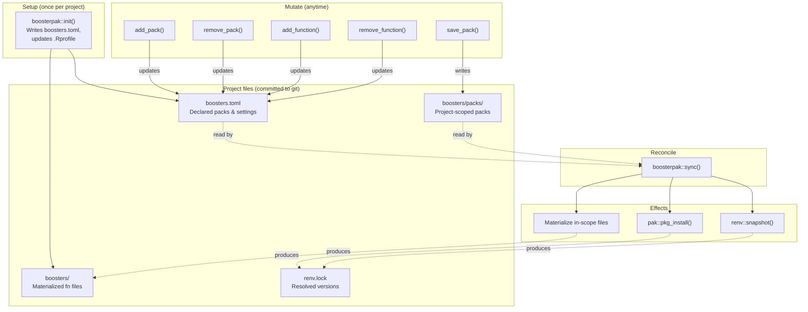
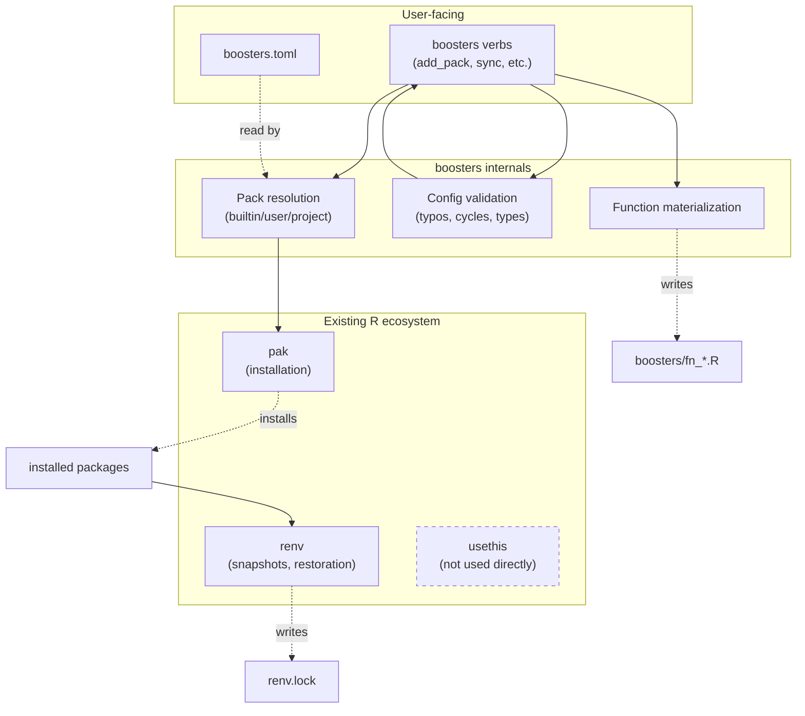

# `boosterpak` — Product Requirements Document

**Status:** Draft v0.1
**Author:** Sean Thimons
**Last updated:** 2026-05-18

---

## 1. Motivation

R practitioners accumulate durable, hard-won knowledge that doesn't fit cleanly into any one R artifact:

- *"Which packages do I always reach for when doing exploratory data analysis?"*
- *"What was the exact `ggsave()`/camcorder configuration I used for that last high-res figure?"*
- *"What's my preferred `skim_with()` recipe?"*
- *"How do I get a new coworker up and running with all of the above in under five minutes?"*

Today this knowledge typically lives in a personal gist (the author's [`load_packages.R`](https://gist.github.com/seanthimons/83106864852fa31b2624b87a30c4a4e3) is the proximate example), a `.Rprofile`, scattered Slack messages, or — most commonly — nowhere durable, surviving only in the practitioner's working memory.

The cost is real:

1. **Self-friction.** Starting a new project means re-deriving the same scaffolding.
2. **Onboarding friction.** Getting a coworker to "work like me" requires shipping them a file, explaining which lines to uncomment, and hoping they don't drift.
3. **Drift across projects.** Two of *your own* projects begun three months apart will diverge in non-obvious ways, making it hard to move code between them.
4. **No clean upgrade path.** When you learn a better idiom (`pak` over `install.packages()`, `nanoparquet` over `arrow` for some use cases), updating every project is manual.

`boosterpak` is an R package that solves these problems by giving practitioners a UV/Cargo-style declarative project manifest, a small but composable system of curated package bundles ("boosters"), and an opt-in mechanism for materializing personal helper functions into projects.

The design borrows from package managers that have demonstrably reduced friction in adjacent ecosystems: **Cargo** (Rust), **UV** (Python), and to a lesser extent **renv** (R) and **shadcn/ui** (TypeScript/React). It does not attempt to replace `renv`, `pak`, or `usethis` — it composes with them.

---

## 2. Target users

**Primary:** R practitioners who already have a personal "starter file" (gist, `.Rprofile`, snippet collection) and want to formalize it without writing a full R package every time.

**Secondary:** Coworkers, collaborators, and team members who need to be onboarded onto a primary user's working conventions with minimal effort.

**Explicitly not targeted in v0.1:**

- R package authors building production packages (use `usethis` / `devtools`).
- Shiny app developers using `golem` or `rhino` (though `boosters` should not collide with these — see §6.2).
- Users seeking a full reproducibility lockfile system (use `renv` directly; `boosters` interoperates with but does not replace it).

---

## 3. Goals & non-goals

### 3.1 Goals

| # | Goal |
|---|------|
| G1 | One-command onboarding: `pak::pkg_install("seanthimons/boosterpak"); boosterpak::sync()` reproduces the author's environment in a cloned project. |
| G2 | Human-edited project config in a single, forgiving file format (TOML). |
| G3 | Composable package bundles via "packs," with three scopes: built-in, user, project. |
| G4 | Personal helper functions (`%ni%`, `my_skim`, etc.) ship as defaults in the package and can be opt-in materialized into projects as editable files. |
| G5 | Verb-driven mutation (`add_pack`, `remove_pack`, `add_function`, `remove_function`, `sync`) — never require hand-editing TOML, though that path remains valid. |
| G6 | Aggressive validation: typos in pack names get did-you-mean suggestions; cycles in pack composition are detected; the tool fails loudly and helpfully. |
| G7 | Zero collision with `golem`, `rhino`, `usethis`, `devtools`, or `renv` workflows. |

### 3.2 Non-goals

| # | Non-goal | Rationale |
|---|---|---|
| NG1 | Replacing `renv` as the lockfile system. | `renv` already does this well. `boosters` can produce `renv.lock` via `renv::snapshot()` and can restore from it explicitly, but normal project intent remains in `boosters.toml`. |
| NG2 | Cross-language environment management. | UV does this for Python; `boosters` is R-only. |
| NG3 | A package registry or hosting service for community packs. | v0.1 supports sharing packs via TOML files exchanged out-of-band (Slack, GitHub gists, etc.). Centralized discovery is deferred. |
| NG4 | User-authored functions sourced from arbitrary external repos. | Materialized functions ship with `boosters` itself; community functions are deferred (see §9). |
| NG5 | A GUI / RStudio addin. | CLI-only in v0.1. Addins may be added later. |
| NG6 | Configuration of arbitrary tool settings beyond what `boosters` itself uses. | The `[settings]` table holds `boosters`-specific options only. Not a general-purpose project config file. |

---

## 4. Anchor scenarios

These are the user stories the design must serve. Every design decision in this PRD traces back to at least one of these.

### Scenario A: Starting a new project

> Sean creates a new project in RStudio. He runs `boosterpak::init()`. A `boosters.toml` appears in the project root with sensible defaults. He runs `boosterpak::sync()`. The tidyverse plus a handful of his standard packages are installed. He opens a Quarto doc and starts working.

### Scenario B: Adding a capability to an existing project

> Sean is mid-project and realizes he needs the documented example pack. He runs `boosterpak::add_pack("example")`. The pack's packages are installed immediately. He restarts R and `cli` is available.

### Scenario C: Onboarding a coworker

> Sean's coworker clones the project's git repo. They run `boosterpak::sync()`, which applies the package intent declared in `boosters.toml` and installs missing packages. If the project owner wants exact lockfile fidelity, the coworker instead runs `boosterpak::sync(mode = "restore")`, which restores from `renv.lock`. The coworker opens R and is working in Sean's declared environment without further setup.

### Scenario D: Capturing a working environment as a reusable pack

> Sean has been refining a project's package list and likes the current state. He runs `boosters::save_pack("project_baseline")`. A new TOML file is written to `boosters/packs/project_baseline.toml` capturing the current package set. He can reference this pack from other projects.

### Scenario E: Promoting a useful project pack to user scope

> Sean's `project_baseline` pack proves broadly useful. He runs `boosters::promote_pack("project_baseline")`. The pack is copied to `~/.config/boosters/packs/` and is now available across all his projects on this machine.

### Scenario F: Customizing a helper function

> Sean wants `my_skim` to include a coefficient-of-variation column. He runs `boosters::add_function("my_skim")`. A file `boosters/fn_my_skim.R` appears with the package's default implementation. He edits it. His project now uses his customized version; the package default is unchanged.

---

## 5. Lifecycle overview

This is the mental model the entire system is built around. Everything below is implementation detail in service of this diagram:



**Key invariants:**

- **TOML is always the source of truth.** Every mutation flows through it. The filesystem (`boosters/*.R`) and the installed environment are projections.
- **`sync()` is the reconciliation function.** By default, `sync(mode = "apply")` makes the filesystem and environment match what TOML declares. `sync(mode = "restore")` is the explicit path for restoring exact package versions from `renv.lock`.
- **Mutate verbs are eager by default.** `add_pack("example")` installs missing packages immediately; it doesn't just edit TOML and defer.
- **Package sync is additive only in v0.1.** `remove_pack()` removes declarations from TOML. `remove_pack(sync = TRUE)` then runs additive sync, but it never uninstalls packages in v0.1.
- **`renv.lock` is downstream of normal sync.** In `mode = "apply"`, `boosters` treats TOML as intent and `renv.lock` as output. Exact lockfile restoration is available only through `mode = "restore"`.

---

## 6. File layout and conventions

### 6.1 Project root after `init()` and basic usage

```
my-project/
|-- boosters.toml              # human-edited config (intent)
|-- boosters/                  # tool-managed (projection)
|   |-- packs/                 # project-scoped pack definitions
|   |   `-- project_baseline.toml
|   `-- fn_*.R                 # Phase 2+: materialized function files
|-- renv.lock                  # machine-managed lockfile output
|-- renv/                      # renv's internals
|-- air.toml                   # written by init() if requested
|-- .Rprofile                  # contains the boosters source line if accepted
`-- (rest of project)
```

### 6.2 Why `boosters/` and not `R/`?

`R/` is a reserved directory for R package source code. Using it for `boosters`'s materialized files would:

- Collide with `golem`, `rhino`, and any `usethis::create_package()` project.
- Trip `R CMD check` and `devtools::load_all()`.
- Cause double-loading if the project later becomes a package.

`boosters/` is namespaced, self-documenting, and zero-collision. It mirrors how `renv/` is named.

### 6.3 File naming inside `boosters/`

Materialized function files use the prefix `fn_` (e.g., `fn_ni.R`, `fn_my_skim.R`). This serves two purposes:

1. Makes it visually obvious which files are managed by `boosters` vs. user-added.
2. Reserves the un-prefixed namespace for future tool use (e.g., `init_*.R`, `recipe_*.R`).

> **[DEFERRED 6.3.A | Phase 2]** Should the `fn_` prefix appear in the function name itself, or only in the filename? Current recommendation: filename-only — `boosters::add_function("ni")` materializes `boosters/fn_ni.R` which defines `` `%ni%` ``. The user-facing identifier ("ni") and the file naming convention are separable.

### 6.4 The `.Rprofile` line

`init()` appends one line to `.Rprofile`:

```r
if (dir.exists("boosters")) invisible(lapply(list.files("boosters", "^fn_.*\\.R$", full.names = TRUE), source))
```

This is the only piece of "automatic" behavior in the system. It sources every `fn_*.R` file in `boosters/` at session start.

**Design decisions:**

- The pattern `^fn_.*\\.R$` ensures only function files are sourced. Pack TOMLs in `boosters/packs/` are unaffected (different extension), and any future `boosters/`-managed files with other prefixes won't accidentally execute.
- `init()` MUST show the user the exact line being added and ask for confirmation before modifying `.Rprofile`.
- If `.Rprofile` already exists and the line is already present, do nothing.
- If `.Rprofile` exists and the line is absent, prompt to add it.
- If `.Rprofile` contains a project-local `renv` activation line such as `source("renv/activate.R")`, insert the boosters line after that activation line so `renv` remains responsible for library activation before helpers are sourced.
- If no `renv` activation line is present, append the boosters line using the same prompt and non-interactive rules.
- If the user removes the line manually, a later `init()` prompts again because absence is treated as unresolved setup. It never silently re-adds the line.

> **[DECISION 6.4.A]** If `.Rprofile` exists but does not have the boosters line, `init()` prompts to add it. No silent re-add.

---

## 7. Configuration: `boosters.toml`

The project-level config file. Human-edited (though normally mutated by verbs). Single file for the project; pack definitions live elsewhere (see §8).

### 7.1 Example

```toml
# boosters.toml — project configuration
# Edit this file directly or use boosterpak::add_pack() / remove_pack() etc.

[project]
name = "my-water-quality-analysis"
boosters_version = "0.1.0"   # the version of boosters that wrote this file

[packs]
declared = ["core", "example", "github-example"]

[extras]
# One-off packages not in any pack
declared = [
  "seanthimons/ComptoxR",
  "rstudio/pointblank",
]

[exclude]
# Packages a pack would normally include, but you don't want
declared = ["arrow"]

[settings]
air_toml = true                          # write air.toml on init
parallel_daemons = "auto"                # or an integer
auto_snapshot = true                     # call renv::snapshot() at end of sync()
```

### 7.2 Schema notes

- **`[project].boosters_version`** is written by `init()` and updated by `sync()`. It's informational, not a constraint — `boosters` does not refuse to operate on TOMLs from older versions, but `sync()` may warn if the file was written by a newer version than the installed `boosters`.
- **`[packs].declared`** is the list of pack names to install. Resolution order: project → user → built-in (see §8.3).
- **`[extras].declared`** holds packages not bundled in any pack. Strings can be plain CRAN names (`"pointblank"`), `user/repo` GitHub references, or anything `pak` understands.
- **`[exclude].declared`** is a deny-list applied after pack resolution. If a future curated pack includes `arrow` but you don't want it, list `arrow` here.
- **`[functions].installed`** is introduced in Phase 2/v0.2. It tracks which function files have been materialized via `add_function()`, and Phase 2 `sync()` ensures every name here corresponds to a file in `boosters/`.
- **`[settings]`** holds `boosters`-specific options. Phase 1/v0.1 consumes only `air_toml`, `auto_snapshot`, and `parallel_daemons`; settings are NOT a general-purpose config bag for unrelated tools.

> **[DECISION 7.2.A]** `[settings.camcorder]` is declarative only and deferred beyond v0.1. A future `boosters::camcorder_config()` helper may read the TOML and return a list the user passes to `camcorder::gg_record()`. v0.1 does not auto-call `camcorder::gg_record()`.

> **[DECISION 7.2.B]** `boosters_version` is a plain string matching `utils::packageVersion("boosters")`.

### 7.3 Validation requirements

When `sync()` runs, it validates `boosters.toml` BEFORE any `pak` calls:

1. **TOML parses.** Surface the parser's error verbatim with file and line.
2. **All declared pack names resolve.** Unknown names get a did-you-mean suggestion via `agrep` or `stringdist::amatch` against the union of available packs.
3. **No cycles in pack `extends` chains** (see §8.4).
4. **Type checks on Phase 1 settings.** `parallel_daemons` is `"auto"` or a positive integer; `air_toml` and `auto_snapshot` are booleans.
5. **Unknown keys produce warnings, not errors.** Forward-compat for newer `boosters` versions writing fields older versions don't understand.

Phase 2 adds validation that all function names in `[functions].installed` exist in the package's catalog, with the same did-you-mean treatment used for packs.

The validator's error messages should look like this:

```
✖ boosters.toml is invalid:

  In [packs].declared (line 9):
    "exampel" is not a known pack.
    Did you mean: "example"?

  Available packs:
    Built-in: core, example, github-example
    User:     (none)
    Project:  (none)

  Run boosterpak::list_packs() for descriptions.
```

This is the difference between a tool that's pleasant and one that isn't. Budget real time for error-message design.

---

## 8. Packs

### 8.1 Three scopes

| Scope | Location | Authored by | Travels with |
|---|---|---|---|
| Built-in | `inst/packs/*.toml` inside the `boosters` package | Package maintainer (Sean) | The `boosters` package version |
| User | `tools::R_user_dir("boosters", "config")/packs/*.toml` | The user | The user's machine |
| Project | `boosters/packs/*.toml` in the project root | The user (in a project) | The project (via git) |

### 8.2 Pack TOML schema

```toml
# boosters/packs/my_eda.toml
name = "my_eda"
description = "My standard EDA stack with cohort-specific extras"

packages = [
  "tidyverse",
  "skimr",
  "janitor",
  "fuzzyjoin",
]

# Packs this one extends. Resolved transitively.
extends = ["core"]

# Per-package source overrides for non-CRAN packages.
[sources]
"ComptoxR" = "seanthimons/ComptoxR"
"pointblank" = "rstudio/pointblank"
```

**Schema rules:**

- `name` is required and must match the filename (minus `.toml`).
- `description` is required (used in `list_packs()` output).
- `packages` is required, even if empty (a pack that only extends others is unusual but legal).
- `extends` is optional; if absent, the pack stands alone.
- `[sources]` is optional and maps package names to `pak`-resolvable source strings.

### 8.3 Resolution order

When the user references pack `"example"`:

1. Look in `./boosters/packs/example.toml` (project scope).
2. If not found, look in `<user_config>/packs/example.toml` (user scope).
3. If not found, look in `system.file("packs/example.toml", package = "boosters")` (built-in).
4. If still not found: validation error with did-you-mean.

**First match wins.** This means user and project packs can shadow built-in packs of the same name. This is intentional — it lets users customize without forking. `list_packs()` always shows the source so there's no mystery.

### 8.4 Pack composition via `extends`

A pack's effective package list is the union of:

- Its own `packages` field
- The effective package lists of all packs in its `extends` field (recursive)
- Minus any packages in the project's `[exclude].declared`

Resolution algorithm:

```
resolve_pack(name, visited = set()):
  if name in visited: ERROR "cycle detected: {visited} -> {name}"
  pack = load_pack(name)
  result = pack.packages
  for parent in pack.extends:
    result = union(result, resolve_pack(parent, visited + {name}))
  return result
```

The cycle check is non-optional. Implement it in v0.1 even though users are unlikely to hit it — the failure mode without it (stack overflow with an opaque message) is significantly worse than the cost of implementing it.

### 8.5 The `save_pack` workflow

`boosters::save_pack(name, scope = "project", from = NULL)` captures the current project's resolved package set as a new pack TOML.

- `scope = "project"` (default): writes to `boosters/packs/<name>.toml`.
- `scope = "user"`: writes to `<user_config>/packs/<name>.toml`.
- `from = NULL` (default): captures all packages currently resolved from the project's `boosters.toml`.
- `from = "core"`: captures only what the named pack contributes (useful for forking a built-in pack to customize).

The saved pack flattens to actual package names; it does not retain `extends` references to other packs. This is intentional — the captured pack is a snapshot, not a live composition. If the parent pack changes upstream, the saved pack does not drift.

`boosters::promote_pack(name)` copies a project pack to user scope. `boosters::demote_pack(name)` is the inverse. Both refuse to overwrite without `overwrite = TRUE`.

> **[DEFERRED 8.5.A | Phase 3]** When `save_pack` runs in a project that has `[extras]` and `[exclude]` declared, should those be folded into the saved pack? Current recommendation: yes, fold them into `packages` (extras included, excludes removed). The saved pack should be self-contained.

### 8.6 Built-in pack catalog (v0.1)

The v0.1 built-in catalog is intentionally small. It should prove the pack mechanism, local template/example behavior, and non-CRAN `pak` source routing without requiring the full personal catalog to be curated before the walking skeleton ships. Each pack lives in `inst/packs/<name>.toml` in the package source.

| Pack | Purpose | Approximate contents |
|---|---|---|
| `core` | Always-useful foundation | `fs`, `here`, `janitor`, `rio`, `tidyverse`, `digest` |
| `example` | Minimal template pack used in docs/tests | `cli` |
| `github-example` | Demonstrates non-CRAN source routing through `pak` | `ComptoxR` with source `"seanthimons/ComptoxR"` |

> **[DECISION 8.6.A]** v0.1 ships only `core`, `example`, and `github-example`. The broader curated catalog is deferred to later phases. Exact contents: `core` contains `fs`, `here`, `janitor`, `rio`, `tidyverse`, and `digest`; `example` contains `cli`; `github-example` contains `ComptoxR` with `[sources] "ComptoxR" = "seanthimons/ComptoxR"`.

---

## 9. Functions

Function materialization is a Phase 2/v0.2 feature. Phase 1/v0.1 does not require function catalog files, does not validate function catalog entries, and does not include `[functions]` in the main `boosters.toml` example. This section records the intended Phase 2 contract so the v0.1 schema can remain forward-compatible without carrying dormant implementation complexity.

### 9.1 The default-vs-materialized model

This is the most novel piece of the design and bears explanation.

**Every catalog function exists in two forms:**

1. **The default**, exported by the `boosters` package itself. Always available via `boosters::my_skim()` etc. with no user action.
2. **The materialized copy**, written to `boosters/fn_<name>.R` in the project when the user calls `add_function()`. The materialized copy shadows the default for that project (because the `.Rprofile` line sources it after the package loads).

This is the [shadcn/ui](https://ui.shadcn.com/) pattern adapted to R. It serves two needs simultaneously:

- **Defaults work out of the box.** A coworker who never touches `add_function()` still gets `boosters::my_skim()`.
- **Customization is non-destructive.** Editing `boosters/fn_my_skim.R` does not affect any other project, and the package's default version stays as a reference.

### 9.2 Catalog (v0.2)

Initial functions, drawn from the author's gist:

| Function | Description |
|---|---|
| `ni` | `` `%ni%` `` — negation of `%in%` |
| `my_skim` | `skim_with()` preset for numeric EDA with geometric mean and inline histogram |
| `theme_custom` | Minimal ggplot2 theme with white panels and angled x-axis labels |
| `geo_mean` | Geometric mean of positive values |

> **[DEFERRED 9.2.A | Phase 2]** Are there other helper functions in the author's day-to-day workflow that should ship in the Phase 2 catalog? The gist is heavily commented; some functions may be intentional inclusions and others abandoned experiments. Confirm the v0.2 catalog before implementing Phase 2.

### 9.3 Verbs (v0.2)

- `boosters::list_functions()` — show all available functions with descriptions and current installation status.
- `boosters::add_function(name)` — copy the package's version of the function into `boosters/fn_<name>.R` and add `name` to `[functions].installed`.
- `boosters::remove_function(name)` — delete `boosters/fn_<name>.R` and remove from TOML.
- `boosters::check_functions()` — diff installed local copies against the current package versions; report drift.

Phase 2 introduces this TOML table:

```toml
[functions]
installed = ["ni", "my_skim"]
```

### 9.4 The `check_functions()` drift detector

When `boosters` ships a v0.2 with an improved `my_skim`, projects that already materialized `my_skim` keep their old version (correctly — overwriting user edits silently would be hostile). But the user should be able to see this:

```
boosters::check_functions()
#> ℹ boosters/fn_my_skim.R differs from boosters::my_skim (package v0.2.0)
#>   Run boosters::diff_function("my_skim") to see changes.
#>   Run boosters::add_function("my_skim", overwrite = TRUE) to update.
#>
#> ✔ boosters/fn_ni.R matches package version.
```

This is the same pattern shadcn implements (`npx shadcn diff`).

> **[DEFERRED 9.4.A | Phase 2]** How is the "package version" of a function determined for diffing? Options: (a) literal string comparison against the file in `inst/functions/<name>.R`; (b) tracking a hash in `[functions]` (e.g., `installed = [{ name = "my_skim", hash = "..." }]`); (c) version stamp in the materialized file's comment header. Current recommendation: (a) for simplicity in v0.2, (b) if it turns out users frequently want "I'm on a known-good snapshot, don't bother me about drift."

### 9.5 Deferred: user-authored function sources

The compelling but underspecified feature is `add_function("my_thing", source = "github:user/repo")` — pulling a function from an external source. This is deferred because:

1. The trust/safety model is non-trivial (arbitrary R code from the internet).
2. The interaction with `check_functions()` is unclear (what does "drift" mean for an external source?).
3. There's no concrete usage pattern to design against in v0.1.

When this returns in v0.3 or later, it'll need its own mini-PRD.

### 9.6 Deferred: camcorder settings

`camcorder` remains useful for the author's plotting workflow, but its settings are not consumed by Phase 1/v0.1. A future declarative section may look like this:

```toml
[settings.camcorder]
enabled = false
dpi = 320
width = 10
height = 7
units = "in"
```

In v0.2 or later, `boosters::camcorder_config()` may return these values as a list the user passes to `camcorder::gg_record()`. `boosters` does not auto-call `camcorder::gg_record()` on session start.

---

## 10. The verb surface

Complete inventory of public functions.

### 10.1 Project lifecycle

| Verb | Purpose |
|---|---|
| `boosterpak::init(renv = c("ask", "yes", "no"), rprofile = c("ask", "yes", "no"))` | Initialize or repair project setup. Creates `boosters.toml` if absent, never overwrites it by default, and continues checking setup items such as `air.toml`, project-local `renv`, and the `.Rprofile` line when the TOML already exists. |
| `boosterpak::sync(mode = c("apply", "restore"))` | `mode = "apply"` reconciles the project to TOML intent by installing missing packages and materializing in-scope files. `mode = "restore"` restores exact package versions from `renv.lock`. v0.1 sync is additive only and never uninstalls packages. |
| `boosterpak::status()` | Show the current project setup state for cold-boot debugging: config presence/validity, resolved packs, missing declared packages, `renv` state, and `.Rprofile` hook state. |

`boosterpak::sync()` defaults to `mode = "apply"`.

`boosterpak::init()` is idempotent for setup:

- If `boosters.toml` is absent, create it.
- If `boosters.toml` exists, do not overwrite it and continue checking other setup items.
- If `.Rprofile` exists and the boosters line is absent, prompt to add it.
- If a setup file would be overwritten, refuse unless the relevant explicit overwrite or repair option is provided.

`boosterpak::init()` manages project-local `renv` only through the explicit `renv` argument:

- `renv = "ask"` default: in interactive sessions, prompt before calling `renv::init()` if no active project-local `renv` is detected.
- `renv = "ask"` in non-interactive sessions: do not initialize `renv`; report that the caller can use `renv = "yes"` to opt in.
- `renv = "yes"`: call `renv::init()` if no active project-local `renv` is detected.
- `renv = "no"`: never call `renv::init()`.
- If a project-local `renv` is already active, do nothing.

`boosterpak::init()` manages `.Rprofile` only through the explicit `rprofile` argument:

- `rprofile = "ask"` default: in interactive sessions, prompt before adding the boosters line if absent.
- `rprofile = "ask"` in non-interactive sessions: error if the line is absent and tell the caller to use `rprofile = "yes"` or `rprofile = "no"`.
- `rprofile = "yes"`: add the boosters line if absent.
- `rprofile = "no"`: do not add the boosters line; report that helper auto-sourcing is disabled.
- If the boosters line is already present, do nothing.

**`mode = "apply"` semantics:**

- Require an active project-local `renv` library; otherwise error clearly and suggest running `boosterpak::init(renv = "yes")` or `renv::init()`.
- Read `boosters.toml`.
- Resolve packs, extras, and excludes.
- Install missing declared packages via `pak` into the project-local `renv` library.
- Materialize any in-scope files for the current phase.
- If `auto_snapshot = true`, call `renv::snapshot()` after installation.
- Treat `renv.lock` as downstream output, not intent.

**`mode = "restore"` semantics:**

- Require `boosters.toml` to exist; otherwise error clearly and suggest `renv::restore()` directly for lockfile-only projects or `boosterpak::init()` to create a boosters project.
- Require `renv.lock` to exist; otherwise error clearly.
- Call `renv::restore()`.
- Validate `boosters.toml` after restore.
- Resolve direct package names from declared packs and extras, then warn only if any direct resolved package name is absent from `renv.lock`.
- Ignore transitive dependencies, package versions, and source-reference drift in v0.1 restore consistency checks.
- Do not update `boosters.toml`.
- Do not snapshot automatically.

**Pruning semantics:**

- v0.1 has no `prune` argument and never uninstalls packages.
- Pruning is deferred until ownership, transitive dependency handling, and user-installed package safety are designed explicitly.

`boosterpak::status()` is included in v0.1 as a narrow diagnostic verb for cold-boot setup and debugging. It reports:

- whether `boosters.toml` exists and validates;
- resolved pack names and package names;
- declared packages missing from the active library;
- whether a project-local `renv` is active;
- whether `renv.lock` exists;
- whether `.Rprofile` contains the boosters source line.

It does not report function drift in v0.1 because function materialization is Phase 2.

### 10.2 Pack management

| Verb | Purpose |
|---|---|
| `boosterpak::add_pack(name)` | Add a pack to `[packs].declared`. Eagerly syncs by default. |
| `boosterpak::remove_pack(name)` | Remove a pack from `[packs].declared`. Eagerly runs additive sync by default, but does not uninstall packages. |
| `boosterpak::list_packs(scope = NULL)` | List available packs (built-in + user + project) with descriptions and sources. |
| `boosterpak::save_pack(name, scope = "project", from = NULL)` | Phase 3: capture the current resolved package set as a new pack TOML. |
| `boosterpak::promote_pack(name)` | Phase 3: copy a project pack to user scope. |
| `boosterpak::demote_pack(name)` | Phase 3: copy a user pack to project scope. |

Mutate verbs that default to eager sync must preflight sync requirements before writing TOML:

- With `sync = TRUE`, validate the requested mutation and verify an active project-local `renv` library before mutating `boosters.toml`.
- If preflight fails, leave `boosters.toml` unchanged.
- After a successful preflight, mutate TOML and run additive `sync(mode = "apply")`.
- With `sync = FALSE`, mutate TOML without requiring active project-local `renv`; the user is responsible for running `sync()` later.

Mutating verbs must validate TOML with a TOML parser before writing. They then make targeted edits to known arrays such as `[packs].declared`, preserving unrelated comments, section order, and user formatting where possible. If a targeted edit cannot be made safely, the verb should fail clearly rather than rewriting the full file.

### 10.3 Function management (Phase 2)

| Verb | Purpose |
|---|---|
| `boosters::add_function(name)` | Materialize a function into `boosters/fn_<name>.R`. Updates TOML. |
| `boosters::remove_function(name)` | Delete the materialized file and remove from TOML. |
| `boosters::list_functions()` | Show available functions with descriptions and installation status. |
| `boosters::check_functions()` | Report drift between materialized files and package versions. |
| `boosters::diff_function(name)` | Show diff between materialized and package versions. |

### 10.4 Common arguments

- **`sync = TRUE/FALSE`** on mutate verbs. Default `TRUE` (eager). `sync = FALSE` edits TOML only, defers installation.
- **`overwrite = FALSE`** on operations that could clobber. Always default `FALSE`; refuse with a clear error message that suggests the explicit flag.
- **`verbose = NULL/TRUE/FALSE`** on public verbs with routine user-facing output. The choices are exclusive: `NULL` uses the default context-aware behavior, `TRUE` always prints routine summaries, and `FALSE` suppresses routine summaries. Warnings and errors are never suppressed.

### 10.5 Output style

All verbs use `cli` for output. Conventions:

- ✔ for success (`cli_alert_success`)
- ✖ for errors (`cli_abort`)
- ℹ for informational (`cli_alert_info`)
- ! for warnings (`cli_alert_warning`)

Verbs return invisibly (typically the updated config or affected file paths) so they compose in scripts but don't clutter interactive sessions.

> **[DECISION 10.5.A]** Verbs print routine summaries by default in interactive sessions and stay quiet by default in non-interactive sessions. `verbose = TRUE` forces summaries on; `verbose = FALSE` suppresses routine summaries; warnings and errors still print.

---

## 11. Relationship to `renv`, `pak`, and the broader ecosystem

`boosters` is a layer *above* existing tools, not a replacement. This section is explicit about who does what.



**Who does what:**

| Task | Tool |
|---|---|
| Declaring intent (packages in Phase 1; functions added in Phase 2) | `boosters` (`boosters.toml`) |
| Resolving pack names to package lists | `boosters` |
| Installing packages | `pak` (called by `boosters`) |
| Locking installed versions | `renv` (called by `boosters` when `auto_snapshot = true`) |
| Restoring exact package versions from lockfile | `boosterpak::sync(mode = "restore")` calls `renv::restore()` and requires `renv.lock` |
| Project initialization | `boosterpak::init()`, NOT `usethis::create_project()` |

### 11.1 Workflow comparison

**Pure `renv` (today):**

1. `renv::init()` initializes lockfile-driven environment.
2. User installs packages manually (`install.packages()`, `remotes::install_github()`).
3. `renv::snapshot()` captures state to `renv.lock`.
4. Collaborator runs `renv::restore()` to reproduce.

**`renv` + `boosters`:**

1. `boosterpak::init()` writes `boosters.toml` (intent) and handles `renv::init()` according to `renv = c("ask", "yes", "no")`.
2. User runs `boosterpak::add_pack("example")` — installs missing packages via `pak`, snapshots via `renv` if enabled.
3. Collaborator runs `boosterpak::sync()` — applies TOML intent by resolving declared packs and installing missing packages.
4. If exact lockfile fidelity is required, collaborator runs `boosterpak::sync(mode = "restore")` — restores from `renv.lock` via `renv::restore()` and does not snapshot.

The key difference: `boosters.toml` is the *intent layer* that `renv.lock` alone doesn't provide. A `renv.lock` says "these exact packages at these exact versions"; a `boosters.toml` says "I want the core pack and the github-example pack" — which generates the package list.

### 11.2 Interop with `rv`

> **[DEFERRED 11.2.A | Future]** The author mentioned `rv` (Posit's nascent Rust-based R package manager) in conversation. As of writing, `rv` is early-stage and its CLI is not stable. `boosters` should NOT depend on `rv` in v0.1, but the design should not preclude a future "use `rv` instead of `pak`" option. Current recommendation: treat the installer as a hidden internal abstraction (`boosters:::install_via()` with a `pak` implementation in v0.1) so a future `rv` backend is additive.

---

## 12. Milestones

`boosters` does not need to ship as one piece. Recommended phasing:

### Phase 1 — Walking skeleton (v0.1)

**Goal:** End-to-end happy path for Scenarios A, B, and C.

- `init()`, `sync()`, `status()`, `add_pack()`, `remove_pack()`, `list_packs()`
- TOML schema for project config and pack files
- Built-in seed pack catalog (3 packs from §8.6)
- Pack resolution (project → user → built-in) with cycle detection
- Validation with did-you-mean for typos
- `pak`-backed installation
- `.Rprofile` line management
- `cli`-styled output

**Out of scope for v0.1:** function management, `save_pack`, drift detection.

### Phase 1 acceptance scenarios

**Sync authority:**

- Given `boosters.toml` declares `example` and `renv.lock` is stale, `sync(mode = "apply")` installs packages resolved from `example` and snapshots if enabled.
- Given `renv.lock` exists, `sync(mode = "restore")` calls `renv::restore()` and does not snapshot.
- Given `renv.lock` is missing, `sync(mode = "restore")` errors clearly.
- Given `boosters.toml` is missing, `sync(mode = "restore")` errors clearly and suggests `renv::restore()` for lockfile-only projects.
- Given `renv.lock` lacks a direct package resolved from `boosters.toml`, `sync(mode = "restore")` warns after restore but does not fail solely for that mismatch.

**Removal safety:**

- Given a user removes `example` from TOML after `cli` has been installed, `sync()` does not uninstall `cli`.
- Given `sync()` outside an active project-local `renv` project, it errors.

**v0.1 schema:**

- A v0.1 config without `[functions]` validates.
- Function validation is introduced only in Phase 2.
- Phase 1 implementation does not need function catalog files.

**`.Rprofile`:**

- Existing `.Rprofile` with the boosters line is unchanged.
- Existing `.Rprofile` without the line causes an interactive prompt.
- Existing `.Rprofile` with `source("renv/activate.R")` receives the boosters line after the `renv` activation line.
- Non-interactive `init(rprofile = "ask")` with the boosters line absent errors with an actionable message requiring `rprofile = "yes"` or `rprofile = "no"`.

**TOML mutation:**

- `add_pack("example")` preserves unrelated comments and sections while adding `"example"` to `[packs].declared`.
- `remove_pack("example")` preserves unrelated comments and sections while removing `"example"` from `[packs].declared`.

**Settings:**

- v0.1 validates `air_toml`, `auto_snapshot`, and `parallel_daemons`.
- `[settings.camcorder]` is documented as future/declarative and not consumed in Phase 1.

### Phase 1 implementation status

**Status as of 2026-05-28:** Implemented in the repository as package `boosterpak` version `0.1.0.9000`.

Implemented and verified:

- Package scaffold: `DESCRIPTION`, `NAMESPACE`, `R/`, `inst/packs/`, `man/`, `tests/`, README, getting-started vignette, and GitHub Actions R CMD check workflow.
- Public v0.1 exports: `init()`, `sync()`, `status()`, `add_pack()`, `remove_pack()`, and `list_packs()`.
- `boosters.toml` project config creation and validation.
- Built-in v0.1 pack catalog:
  - `core`: `fs`, `here`, `janitor`, `rio`, `tidyverse`, `digest`
  - `example`: `cli`
  - `github-example`: `ComptoxR` with source override `"seanthimons/ComptoxR"`
- Project/user/built-in pack resolution with first-match wins and project pack shadowing.
- Pack `extends` resolution and cycle detection.
- Did-you-mean validation for unknown pack names, including grouped available packs.
- `[extras].declared` handling for plain CRAN names and `pak`-style refs such as `user/repo`.
- `[exclude].declared` filtering after pack and extras resolution.
- Pack `[sources]` and config-level source overrides converted into `pak` install specs.
- `init()` behavior:
  - creates `boosters.toml` only when absent;
  - creates `boosters/packs/`;
  - writes `air.toml` when `air_toml = true`;
  - manages `.Rprofile` through `rprofile = c("ask", "yes", "no")`;
  - inserts the booster source line after `source("renv/activate.R")`;
  - handles `renv = c("ask", "yes", "no")`;
  - loads an existing inactive project `renv` when `renv = "yes"`.
- `sync(mode = "apply")` behavior:
  - requires an active project-local `renv` library;
  - resolves packs, extras, excludes, and source overrides;
  - installs missing declared packages through `pak`;
  - snapshots with `renv` when `auto_snapshot = true`;
  - remains additive-only and never uninstalls packages.
- `sync(mode = "restore")` behavior:
  - requires both `boosters.toml` and `renv.lock`;
  - calls `renv::restore(project = root)`;
  - validates `boosters.toml` after restore;
  - warns when direct declared package names are absent from `renv.lock`;
  - does not snapshot automatically.
- `status()` diagnostic surface:
  - reports config presence and validity;
  - reports resolved packs and packages;
  - reports missing declared packages from the active library;
  - reports project-local `renv` activity;
  - reports `renv.lock` presence;
  - reports `.Rprofile` hook presence;
  - reports malformed config as invalid instead of aborting.
- TOML mutation behavior:
  - `add_pack()` and `remove_pack()` preserve unrelated comments and sections for supported one-line arrays;
  - eager mutation preflights active `renv` before editing;
  - unsupported multi-line `[packs].declared` edits fail clearly instead of corrupting the file.
- Tests:
  - normal `testthat` suite covers config, packs, mutation, sync error paths, settings validation, source overrides, pack shadowing, and cycle detection;
  - opt-in live tests exercise real `pak` and `renv` behavior in temporary projects with `BOOSTERPAK_LIVE_TESTS=true`.
- Package checks:
  - local `R CMD check --no-manual --ignore-vignettes` passes;
  - local vignette building was not run because Pandoc was unavailable in the development environment;
  - CI is configured to run R CMD check on Ubuntu, macOS, and Windows.

**Manual smoke project status:**

The manual smoke project lives at `~/Documents/boosterpak_test/smoke_20260528_111948`. It currently proves initialization mechanics:

- `boosters.toml` was created.
- `boosters/` and `boosters/packs/` were created.
- `.Rprofile` contains both `source("renv/activate.R")` and the booster helper-source line.
- `renv/` was initialized.
- `renv.lock` was created.
- `air.toml` was written.
- `status()` can detect the config, active `renv`, lockfile, and `.Rprofile` hook.

It does **not** currently prove final package hydration for the final v0.1 catalog. The smoke project's `boosters.toml` declares `["core", "example"]`, but its existing `renv.lock` only contains `renv`, and current `status()` reports most declared packages missing (`fs`, `here`, `janitor`, `rio`, `tidyverse`, and `digest`). Yes: this means the smoke project still needs to be hydrated by running `boosterpak::sync(mode = "apply")` with an active project-local `renv` so `pak` installs the missing packages and `renv::snapshot()` updates `renv.lock`.

Recommended smoke-project repair:

```r
pkgload::load_all("C:/Users/sxthi/Documents/boosterpak")
source("renv/activate.R")
boosterpak::sync(mode = "apply", verbose = TRUE)
boosterpak::status(verbose = TRUE)
```

Expected result after hydration:

- `status()$missing_packages` is empty for packages declared by `["core", "example"]`;
- `renv.lock` includes the directly declared packages installed from `core` and `example`;
- the smoke folder proves both initialization mechanics and final package installation.

### Next work after v0.1

The remaining PRD items are deferred Phase 2+ work, plus one manual verification task:

1. Hydrate the manual smoke project at `~/Documents/boosterpak_test/smoke_20260528_111948` and confirm `status()` reports no missing declared packages.
2. Install `boosterpak` into the user's R library when ready for day-to-day use. Development so far has used `pkgload::load_all()` and package check installs, not a persistent user-library install.
3. Phase 2: implement function materialization (`add_function()`, `remove_function()`, `list_functions()`, `check_functions()`, `diff_function()`, `inst/functions/`, and `[functions].installed`).
4. Phase 3: implement pack capture and promotion (`save_pack()`, `promote_pack()`, `demote_pack()`, and richer user-scope pack workflows).
5. Phase 4/future: broaden `status()`, improve real-world error messages, explore an RStudio addin, keep `rv` integration deferred behind the installer abstraction, and revisit recipe/discovery ideas.

### Phase 2 — Function materialization (v0.2)

**Goal:** Scenario F (customizing helper functions).

- Built-in function catalog (4 functions from §9.2)
- `add_function()`, `remove_function()`, `list_functions()`
- Materialization to `boosters/fn_*.R`
- `[functions].installed` in TOML
- `check_functions()` drift detection
- `diff_function()` for inspection

### Phase 3 — Pack capture and promotion (v0.3)

**Goal:** Scenarios D and E.

- `save_pack()` with `scope` and `from` arguments
- `promote_pack()` / `demote_pack()`
- User-scope pack directory management (`tools::R_user_dir`)
- `list_packs()` extended to show all three scopes

### Phase 4 — Polish and ecosystem (v0.4+)

- Broader `status()` reporting beyond the v0.1 cold-boot diagnostic surface
- Better error messages from real usage
- Optional RStudio addin
- `rv` backend exploration (if `rv` stabilizes)
- User-authored function sources from external repos (the deferred feature in §9.5)
- Sharing/discovery features (deferred from non-goals)

---

## 13. Decisions and deferred questions

This section separates implementation-ready v0.1 decisions from questions intentionally deferred to later phases. Phase 1 implementation should not be blocked by deferred Phase 2+ decisions.

### 13.1 Resolved v0.1 decisions

| ID | Decision |
|---|---|
| 6.4.A | If `.Rprofile` exists but does not have the boosters line, `init()` prompts to add it. No silent re-add. |
| 6.4.B | If `.Rprofile` contains project-local `renv` activation, insert the boosters source line after it. |
| 7.2.A | `[settings.camcorder]` is declarative only and not consumed in v0.1. A future helper may expose it. |
| 7.2.B | `boosters_version` is a plain string matching `utils::packageVersion("boosters")`. |
| 8.6.A | v0.1 ships only `core`, `example`, and `github-example`; the broader catalog is deferred. |
| 10.1.A | `init()` is idempotent setup/repair and does not hard-stop just because `boosters.toml` exists. |
| 10.1.B | `init(renv = c("ask", "yes", "no"))` controls project-local `renv::init()` behavior. |
| 10.1.C | `init(rprofile = c("ask", "yes", "no"))` controls `.Rprofile` hook behavior; non-interactive `ask` errors if action is needed. |
| 10.1.D | v0.1 `sync()` is additive only and has no `prune` argument. |
| 10.5.A | `verbose = NULL/TRUE/FALSE` provides exclusive context-aware/always/suppressed routine output modes. |

### 13.2 Deferred decisions

| ID | Phase | Question | Current recommendation |
|---|---|---|---|
| 6.3.A | Phase 2 | Should the `fn_` prefix appear in function names or only filenames? | Filename only. |
| 8.5.A | Phase 3 | Should `save_pack` fold `[extras]` and `[exclude]` into the saved pack? | Yes; saved packs are self-contained snapshots. |
| 9.2.A | Phase 2 | Final function catalog? | Use §9.2 as a starting point; require author sign-off before Phase 2. |
| 9.4.A | Phase 2 | Mechanism for detecting function drift? | Literal string comparison against `inst/functions/<name>.R`. |
| 10.1.E | Future | Package pruning semantics? | Defer until ownership, transitive dependencies, and user-installed packages have a safety design. |
| 11.2.A | Future | `rv` integration strategy? | Abstract behind internal installer interface; defer concrete work. |

### 13.3 Implementation policy

These implementation policy items are resolved for v0.1:

- **Naming.** The R package name is `boosterpak`. The project manifest remains `boosters.toml`, and the project helper directory remains `boosters/`, because "booster" is the domain noun users interact with.
- **Versioning policy.** Use the default `usethis` / `devtools` `A.B.C.D` development version numbering scheme.
- **Testing strategy.** v0.1 should include live tests against real `pak` / `renv` behavior, with test projects created in temporary directories so the package repository is not mutated as the project under test.
- **Manual live-test project.** Use `~/Documents/boosterpak_test` for human-operated smoke testing. Keep it outside the package repo, and do not use the package source root itself as the project being initialized by `boosterpak`.
- **Documentation.** Ship both a README and a getting-started vignette covering Scenarios A-C: `init()`, `add_pack()`, `sync()`, and `sync(mode = "restore")`.
- **CI matrix.** Target latest R across Ubuntu, Windows, and macOS.

---

## 14. Appendix: deferred ideas

Captured here so future contributors don't relitigate decisions already made.

### 14.1 Things considered and rejected

- **YAML as the config format.** Rejected for indentation fragility, type ambiguity (Norway problem, version strings becoming floats), and historical user pain.
- **A single combined TOML for project + pack definitions.** Rejected because user packs and built-in packs naturally live in separate files; project packs should mirror that structure.
- **R-script-as-config (a `boosters.R` file).** Rejected because the format-format choice was driven specifically by "don't make coworkers edit R files for config."
- **DCF format** (like `DESCRIPTION`). Rejected for poor nested-structure support and limited audience familiarity.
- **A `_local.R` aggregator file** with all functions in one place. Rejected: a 1K-line file of commented stubs reproduces the gist's problem.
- **Auto-sourcing the entire `R/` directory.** Rejected for collision with `golem`, `rhino`, `usethis`.

### 14.2 Things deferred to later phases

- User-authored function sources from external repos (§9.5).
- Centralized pack registry / discovery service (§3.2 NG3).
- Broader built-in pack catalog beyond the v0.1 `core`, `example`, and `github-example` seed packs.
- Recipe / snippet retrieval system (`boosters::recipe("high_res_plot")`).
- RStudio addin.
- `rv` backend (§11.2.A).
- GUI / desktop app.
- Cross-language support (Python via reticulate, etc.).

### 14.3 Recipes — briefly considered

An earlier design iteration included a `recipes()` function for retrieving named code snippets ("how do I save a high-res plot"). This was deferred because:

1. The use case overlaps with RStudio snippets, which already exist.
2. The retrieval API is unclear (return string? insert at cursor? open viewer?).
3. It's a "nice to have" rather than core to the onboarding/durability problems.

If revisited, recipes would live as `.R` files in `inst/recipes/` inside the package, retrievable by name. They are NOT configured in `boosters.toml` — recipes are pull-on-demand, not project-state.

---

## 15. Glossary

- **Pack** — A named collection of R packages, defined in a small TOML file. Comes in three scopes: built-in, user, project.
- **Materialized function** — A helper function that has been copied from the `boosters` package into the project's `boosters/` directory as an editable `.R` file.
- **Default function** — The version of a helper function that ships exported by the `boosters` package itself.
- **Eager sync** — The default behavior where mutate verbs immediately run additive sync after editing TOML. Eager sync installs missing packages but does not uninstall packages in v0.1.
- **Reconciliation** — `boosterpak::sync()`'s job: make the filesystem and installed environment match what `boosters.toml` declares.
- **Drift** — A materialized function file diverging from the package's current default version.

---

*End of PRD v0.1.*
