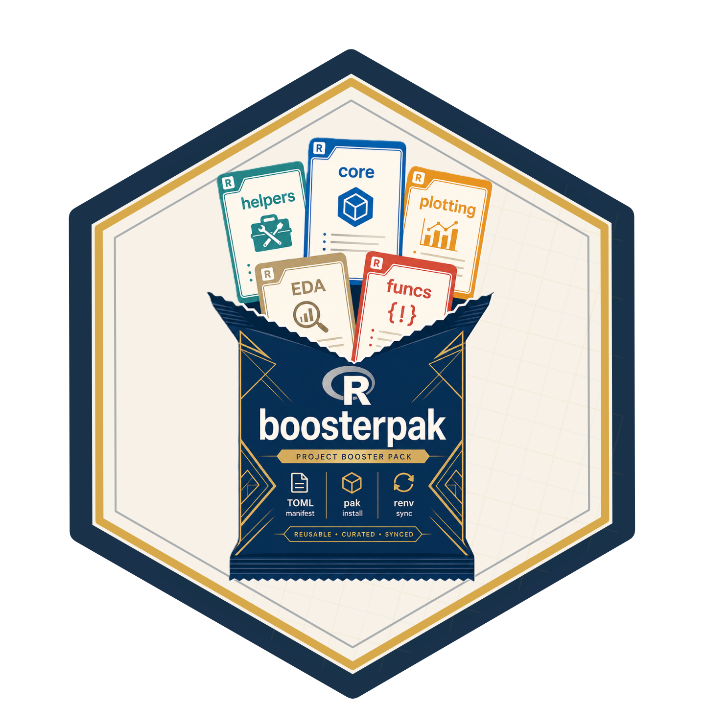
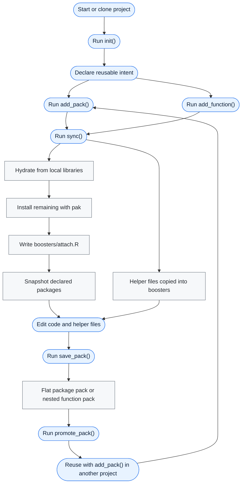

# boosterpak



`boosterpak` is an R package for declaring project package intent in a
human-edited `boosters.toml` file. It resolves named “booster” packs
from project, user, and built-in scopes, reuses locally available
packages with
[`renv::hydrate()`](https://rstudio.github.io/renv/reference/hydrate.html)
when possible, installs anything still missing with `pak`, writes
explicit startup [`library()`](https://rdrr.io/r/base/library.html)
calls to `boosters/attach.R`, and uses `renv` for project-local
libraries and lockfiles.

## 1. Install pak

``` r
install.packages("pak")
```

## 2. Install boosterpak

``` r
pak::pkg_install("seanthimons/boosterpak")
```

## 3. Initialize the project

``` r
boosterpak::init(renv = "yes", rprofile = "yes")
```

[`init()`](https://seanthimons.github.io/boosterpak/reference/init.md)
writes `boosters.toml`, creates `boosters/packs/`, optionally writes
`air.toml`, manages the recommended `.Rprofile` startup hook, and can
initialize project-local `renv`. With `renv = "yes"`, it bootstraps
`renv`, `pak`, and `boosterpak` into the project library and snapshots
those workflow packages before any restart is needed.

## 4. Sync the project

``` r
boosterpak::sync()
```

## Typical Workflow



The usual loop is to initialize once, add packs and helper functions as
project intent, run
[`sync()`](https://seanthimons.github.io/boosterpak/reference/sync.md),
then capture a useful baseline with
[`save_pack()`](https://seanthimons.github.io/boosterpak/reference/save_pack.md).
Additive installs hydrate plain-name packages from local/user libraries
before downloading, install any remaining packages with `pak`, and write
`boosters/attach.R` for startup
[`library()`](https://rdrr.io/r/base/library.html) calls. Package-only
packs stay flat at `boosters/packs/<name>.toml`; packs that carry copied
helper files use `boosters/packs/<name>/<name>.toml` plus
`boosters/packs/<name>/functions/`.

## Add a Pack

``` r
boosterpak::add_pack("example")
```

The built-in pack catalog contains:

- `core`: minimal bootstrap dependencies, `pak` and `renv`.
- `eda`: analysis helpers including `fs`, `here`, `janitor`, `rio`, core
  tidyverse packages, `scales`, `glue`, `digest`, `skimr`, and bundled
  helper functions.
- `example`: small documented example that installs `cli`.
- `scaffold-analysis`: installs `fs` and `here` and carries a helper for
  a compact analysis folder scaffold.
- `github-example`: installs `ComptoxR` from `seanthimons/ComptoxR`.

Packs can mix ordinary CRAN package names with source-specific install
specs. Declare every package in `packages`, then add a `[sources]` entry
only for packages that should come from somewhere else:

``` toml
name = "plotting"
description = "Plotting packages from CRAN and GitHub."
packages = ["ggplot2", "patchwork", "ggtext"]

[sources]
"ggtext" = "wilkelab/ggtext"
```

In this pack, `ggplot2` and `patchwork` install by package name, while
`ggtext` uses the GitHub source spec.

Attachment is separate from installation. Missing `attach` means a pack
attaches its direct `packages`; packs can also use `attach = true`,
`attach = false`, or `attach = ["pkg1", "pkg2"]`. The top-level
`[attach]` table can add packages with `declared`, remove packages with
`exclude`, or set `enabled = false` to remove the managed
`boosters/attach.R` file. Workflow packages from `core` and `[extras]`,
such as `pak`, `renv`, and `boosterpak`, are installed but not attached
unless explicitly listed in `[attach].declared`.

Pack mutation is additive. Removing a pack updates `boosters.toml` and
can run sync, but it does not uninstall packages.

By default,
[`add_pack()`](https://seanthimons.github.io/boosterpak/reference/add_pack.md)
and `sync(mode = "apply")` use `hydrate = TRUE`, so ordinary CRAN-style
package names can be copied from renv-discoverable local libraries
before `pak` downloads anything. Source-specific declarations, such as
GitHub remotes in `[sources]`, skip hydration and install through their
declared spec. Use `hydrate = FALSE` for stricter first-run installs
that should go straight to `pak`.

## Capture and Reuse Packs

``` r
boosterpak::create_pack("analysis", c("dplyr", "rstudio/pointblank"), attach = "all")
boosterpak::save_pack("project_baseline")
boosterpak::promote_pack("project_baseline")
```

[`create_pack()`](https://seanthimons.github.io/boosterpak/reference/create_pack.md)
writes a new pack from declared intent without adding it to
`boosters.toml`, installing packages, or running
[`sync()`](https://seanthimons.github.io/boosterpak/reference/sync.md).
Plain package names are written directly to `packages`; source-specific
specs are preserved under `[sources]`. Use `function_template = "yes"`
to create a nested pack layout with `functions/fn_template.R` for later
manual helper authoring.

[`save_pack()`](https://seanthimons.github.io/boosterpak/reference/save_pack.md)
writes a TOML snapshot of the currently resolved project packages and,
by default, the helper functions listed in `[functions].installed`. Use
`functions = "all"` to capture every `boosters/fn_*.R` file,
`functions = "none"` for a flat package-only pack, `from = "core"` to
fork one existing pack, or `scope = "user"` to write directly to the
machine-wide user pack directory.
[`promote_pack()`](https://seanthimons.github.io/boosterpak/reference/promote_pack.md)
and
[`demote_pack()`](https://seanthimons.github.io/boosterpak/reference/demote_pack.md)
copy flat package-only packs as single files and nested function-bearing
packs as whole directories.

## Restore from a Lockfile

``` r
boosterpak::sync(mode = "restore")
```

`sync(mode = "apply")` treats `boosters.toml` as intent and `renv.lock`
as downstream output. It may hydrate from local libraries before
installing the remaining declared packages with `pak`, then writes
`boosters/attach.R` before snapshot. `sync(mode = "restore")` is the
explicit path for exact lockfile restoration and does not hydrate.

## Troubleshooting 0.5 Init Projects

If a project was initialized with boosterpak 0.5 and a restart made
`boosterpak` unavailable inside `renv`, run this once without relying on
`boosterpak` being loadable:

``` r
install.packages("renv")
renv::install(c("pak", "seanthimons/boosterpak"))
renv::snapshot(packages = c("renv", "pak", "boosterpak"), prompt = FALSE)
```

Then restart R in the project and run:

``` r
boosterpak::sync()
```

## Inspect Status

``` r
boosterpak::status()
boosterpak::list_packs()
```

[`status()`](https://seanthimons.github.io/boosterpak/reference/status.md)
reports config validity, declared and resolved packs, package counts,
missing direct packages, attach package count and file presence,
function drift or missing materialized files, pack catalog counts,
`renv` state, lockfile presence, and the `.Rprofile` hook.

Current development includes function materialization, pack
capture/promotion, and broader project status reporting; pruning remains
out of scope.
