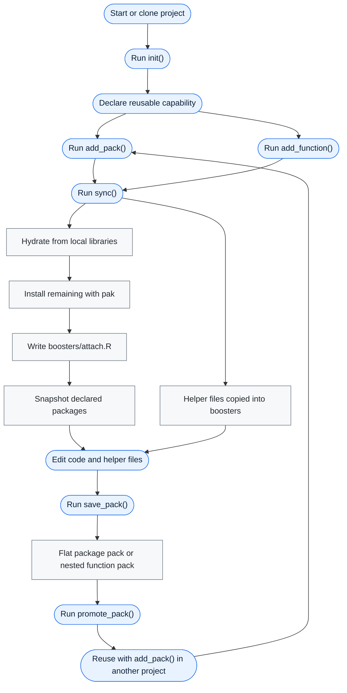

`boosterpak` installs reusable R project packs: typed bundles of package
dependencies, optional source specs, startup attachment intent, and
helper-function sidecars that make a project usable without turning it into a
package. It is less than a package, but more than a fistful of copied files.

`boosters.toml` is the project-local control file for those packs. It is not a
general dependency-manifest standard and `boosterpak` does not depend on one.
`pak` remains the installer, `renv` remains the lockfile and project-library
layer, and `boosterpak` sits above them as a small capability-bundle layer for
reusable setup conventions.

A project declares the packs it wants in `boosters.toml`; `boosterpak::sync()`
resolves those packs, hydrates plain-name packages from local libraries when
possible, and installs anything still missing into the active project-local
`renv` library. It also writes `boosters/attach.R` with explicit startup
`library()` calls for packages intended to be attached.
Packs can also carry exact copied helper files, so a useful project setup can be
reused without separating "packages" from customized `boosters/fn_*.R` files.

## Typical workflow



In practice, initialize once, add pack and function capability intent over time,
run `sync()` whenever the project should match that intent, then save and promote
a pack when the setup is worth reusing.

A pack is deliberately typed and reviewable. Today that means packages, optional
`[sources]`, optional `attach`, optional copied helper functions, and optional
extension from other packs. It is not an arbitrary file sprinkler; project-specific
mess stays in the project, and only reusable setup invariants belong in a pack.

## 1. Install pak

```{r}
#| echo: true
#| eval: false
install.packages("pak")
```

## 2. Install boosterpak

```{r}
#| echo: true
#| eval: false
pak::pkg_install("seanthimons/boosterpak")
```

## 3. Initialize the project

```{r}
#| echo: true
#| eval: false
boosterpak::init(renv = "yes", rprofile = "yes")
```

This creates:

- `boosters.toml`
- `boosters/packs/`
- `air.toml`, when enabled by settings
- a `.Rprofile` startup hook, when requested

The generated `boosters.toml` includes `boosterpak` itself in
`[extras].declared`, so the package needed to run `sync()` is also captured in
project intent and the project lockfile. With `renv = "yes"`, `init()`
bootstraps only `renv`, `pak`, and `boosterpak` into the project library and
creates the initial lockfile when `auto_snapshot = true`.

In non-interactive sessions, use explicit `renv` and `rprofile` arguments. The
default `"ask"` mode never silently changes `.Rprofile` when user confirmation
would be required.

## 4. Sync the project

```{r}
#| echo: true
#| eval: false
boosterpak::sync()
```

Apply mode is additive. It hydrates plain-name missing packages from
renv-discoverable local libraries, installs anything still missing with `pak`,
materializes missing bundled or installed helper functions, and, when
`auto_snapshot = true`, writes `boosters/attach.R` and snapshots with `renv`.
Use `hydrate = FALSE` to skip local reuse for stricter first-run installs.

## Add a Pack

```{r}
#| echo: true
#| eval: false
boosterpak::add_pack("example")
```

The `example` pack installs `cli`. `add_pack()` preserves unrelated comments and
sections in `boosters.toml` while updating `[packs].declared`.
For the analysis baseline of `fs`, `here`, `janitor`, `rio`, core tidyverse
packages, `scales`, `glue`, `digest`, `skimr`, and bundled helper functions,
add the `eda` pack explicitly:

```{r}
#| echo: true
#| eval: false
boosterpak::add_pack("eda")
```

If the pack carries helper functions, `add_pack()` also copies the bundled
`fn_*.R` files into `boosters/` and refuses to overwrite existing function files
unless `overwrite_functions = TRUE`.

Packs can mix ordinary CRAN package names with package-specific source specs.
Declare every package in `packages`, then use `[sources]` only for packages that
should install from another source:

```toml
name = "plotting"
description = "Plotting packages from CRAN and GitHub."
packages = ["ggplot2", "patchwork", "ggtext"]

[sources]
"ggtext" = "wilkelab/ggtext"
```

Here, `ggplot2` and `patchwork` can hydrate or install by package name, while
`ggtext` skips hydration and uses the GitHub source spec.

Package attachment is a startup layer, not installation intent. Missing
`attach` means a pack attaches its direct `packages`; use `attach = true` for
that explicit default, `attach = false` to install without startup attachment,
or `attach = ["pkg1", "pkg2"]` to attach a subset. The top-level `[attach]`
table supports `enabled`, `declared`, and `exclude`. Workflow packages from
`core` and `[extras]`, including `pak`, `renv`, and `boosterpak`, are installed
but not attached unless explicitly listed in `[attach].declared`.

## Add a Helper Function

```{r}
#| echo: true
#| eval: false
boosterpak::add_function("ni")
```

Helper functions are materialized as `boosters/fn_*.R` files and tracked in
`[functions].installed`. They are ordinary project files, so you can edit them
after materialization. `sync()` restores missing installed helper files, but it
does not overwrite local edits.

## Capture and Reuse

```{r}
#| echo: true
#| eval: false
boosterpak::save_pack("project_baseline")
boosterpak::promote_pack("project_baseline")
```

`save_pack()` captures the resolved package set and, by default, helper functions
listed in `[functions].installed`. Use `functions = "all"` to capture every
`boosters/fn_*.R` file, `functions = "none"` for a flat package-only pack, or a
character vector for specific function names. `promote_pack()` and
`demote_pack()` copy flat package-only packs as single files and nested
function-bearing packs as whole directories.

## Related Tools and Boundaries

`boosterpak` is intentionally narrow:

- `pak` resolves and installs package specs.
- `renv` owns project libraries, lockfiles, and exact version restoration.
- `boosterpak` owns reusable project capability packs: dependencies plus the
  small helper files, attachment choices, and setup conventions that are too
  project-shaped for a package and too reusable for copy-paste.

That boundary is the point. `boosterpak` uses TOML for its own pack and project
config, but it is not trying to be a general project requirements format.

## Restore Exact Versions

```{r}
#| echo: true
#| eval: false
boosterpak::sync(mode = "restore")
```

Restore mode requires both `boosters.toml` and `renv.lock`, calls
`renv::restore()`, validates the project config, and warns if direct declared
packages are absent from the lockfile. It remains lockfile-exact and does not
hydrate.

## Troubleshooting boosterpak 0.5 init projects

If a project was initialized with boosterpak 0.5 and, after restart,
`boosterpak` is no longer found, run this once from the project without relying
on `boosterpak` being loadable:

```{r}
#| echo: true
#| eval: false
install.packages("renv")
renv::install(c("pak", "seanthimons/boosterpak"))
renv::snapshot(packages = c("renv", "pak", "boosterpak"), prompt = FALSE)
```

Then restart R and run:

```{r}
#| echo: true
#| eval: false
boosterpak::sync()
```

## Inspect

```{r}
#| echo: true
#| eval: false
boosterpak::status()
boosterpak::list_packs()
```

`status()` reports whether the project config exists and validates, what packs and
packages resolve, whether project-local `renv` appears active, whether
`renv.lock` exists, whether `boosters/attach.R` exists, and whether `.Rprofile`
contains the startup hook.
